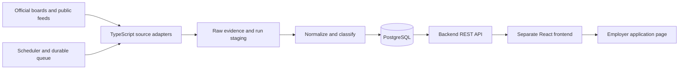

# Jobbely: job extraction tool and MVP plan

**Planning date:** 30 September 2026  
**Status:** MVP boundaries proposed; the first implementation slice is available. See [setup and current limits](README.md), [architecture decisions](docs/ARCHITECTURE.md), and [initial source checks](docs/SOURCE_CHECKS.md). Full 60-company coverage is not yet implemented.  
**Target:** All 60 companies requested, with TypeScript frontend and backend in separate folders.  
**Runtime AI usage:** Zero for extraction, normalization, categorization, and search.

**Quick navigation:** [MVP boundaries](#1-recommendation-and-boundaries) · [First 10 companies](#4-proposed-first-release-10-companies) · [All 60 companies](#5-full-inventory-all-60-target-companies) · [Extraction](#6-extraction-strategy-structured-sources-first) · [Architecture](#7-typescript-architecture-and-folder-separation) · [Data model](#9-data-model-and-provenance) · [Categorization](#10-categorization-without-ai) · [Release gates](#14-verification-and-acceptance-criteria) · [Delivery estimates](#15-delivery-sequence-and-effort) · [Scope decisions](#17-decisions-to-settle-when-reviewing-the-mvp)

## 1. Recommendation and boundaries

Build a source-driven job aggregator. The backend periodically retrieves public vacancies from employer career sites or their applicant tracking systems (ATS), stores the original evidence, normalizes the fields, and applies deterministic category rules. The frontend searches the stored data and links users to the employer's application page.

The UI is relatively small. Reliable coverage across 60 employers is the main engineering task: different boards expose different fields, pagination mechanisms, geographic scopes, and access restrictions. A reusable adapter per source family makes this manageable, but a single universal scraper will not establish complete coverage.

**Recommended delivery:** First ship an end-to-end MVP for 10 companies with observed ATS boards, then expand through reusable adapters to all 60. The complete target list remains a product requirement. Ten companies is a proposed first release boundary, not a replacement for that requirement.

| Boundary | First usable MVP | Full target-coverage milestone |
| --- | --- | --- |
| Companies | 10 named companies in section 4 | All 60 in section 5 |
| Extraction | Greenhouse, Ashby, and Lever | Those adapters plus audited enterprise/custom sources |
| Geographic scope | All public locations exposed by each audited source | All relevant public boards/regions for each target employer |
| Job types | All advertised functions and employment types | Same |
| Job details | Full advertised description, location, source categories, application link | Same, with explicit exceptions if a source omits fields |
| Classification | Source labels plus versioned mapping/title rules | Same, with additional company-specific mappings |
| Refresh | Twice daily plus a local operator command | Per-source schedules tuned to volume and limits |
| User interface | Search, filters, detail page, coverage/freshness view | Same core UI; broader source coverage |
| AI/MCP requirement | Neither needed | Neither required; optional MCP interface later |
| Completeness claim | Complete only for audited source scopes | Complete for all 60 only after their coverage gates pass |

If the first release must already cover all 60, keep this architecture and move the entire source-onboarding program into the MVP. That is a materially larger release, whose schedule should be estimated after the discovery phase. Do not advertise all-60 coverage while some companies are merely registered or partially supported.

### Working assumptions

- Include worldwide public vacancies, not just the Netherlands, Europe, or engineering roles.
- Include internships, graduate roles, part-time roles, and contracts when listed as actual vacancies on an official board.
- Exclude talent-community registration, speculative applications, generic hiring-interest forms, and expired/unlisted vacancies from the default active-jobs view. Preserve an exclusion reason for audit.
- Keep every description in its original language. Automated translation is outside the MVP; unmapped non-English categories can remain `Other / Unclassified`.
- Start as a local or private application for one operator. Public deployment is a separate configuration decision.
- Collect job advertisements, not applicant profiles, resumes, or application submissions.
- No paid aggregation feed, proxy network, CAPTCHA service, or LLM key is required for the proposed API-first MVP.

## 2. What “all active jobs” means

For an onboarded company, retrieve **all publicly listed vacancy postings from its explicitly audited official source scopes**. A company can have several boards: experienced hires, university hires, regional boards, or separate brands. A parent company's board does not automatically prove coverage of a subsidiary.

An active record means the source most recently advertised that posting as available. It does not guarantee that the employer is still accepting applications at the exact moment someone opens the page. Show the last observation time and let the employer's application page remain authoritative.

Establish completeness at three levels:

1. **Company scope:** Have all relevant public boards, regions, brands, and recruitment channels been enumerated?
2. **Listing traversal:** Did the run exhaust the source's pages/cursors/partitions without hidden filters, truncation, or access failures?
3. **Detail coverage:** Did every listed vacancy receive the promised description and essential fields?

A source can have complete enumeration but incomplete detail hydration. Track both flags separately. Only a successful exhaustive enumeration can support removal reconciliation; missing detail requests must never be interpreted as vanished listings.

Never infer “zero jobs” from an empty JavaScript shell, a CAPTCHA page, an HTTP error, or a search result rendered with default filters. For example, Apple's [English search page](https://jobs.apple.com/en-us/search) redirected to a United States-filtered result during this planning audit. The adapter must explicitly establish worldwide scope rather than assume that English means global.

## 3. Evidence and research limits

This plan uses primary ATS documentation and employer career/hosted-board pages reviewed on the planning date. Links in the inventory are the discovery seeds and supporting evidence. They are not an executable, validated source configuration.

**Evidence labels:**

- **B — Board evidence:** A hosted ATS board or employer-linked ATS posting was observed. This supports the proposed adapter family, but does not establish API payload compatibility or complete company coverage.
- **C — Career-page evidence:** The employer's career page was readable; its extraction endpoint and complete scope still require discovery.
- **U — Unresolved:** The attempted page could not be read by the research tool, or employer identity/source attribution needs resolution. This is not evidence that jobs are unavailable.

No end-to-end extraction or live JSON payload validation was completed for this document. Direct API requests from the local shell were blocked by this workspace's network restrictions, and the research browser could not retrieve the attempted JSON endpoints. Do not treat source counts, adapter feasibility, or permissions as verified on that basis. Implementation phase 0 must record actual responses and traversal evidence in an environment that can reach the sources.

## 4. Proposed first release: 10 companies

These companies exercise three documented API families, original department labels, technical and nontechnical roles, and a company with multiple boards. Board tokens below are observed discovery candidates; verify their payloads and employer scope before enabling them.

| Company | Adapter | Candidate board identifier | Supporting evidence |
| --- | --- | --- | --- |
| OpenAI | Ashby | `openai` | [Hosted board](https://jobs.ashbyhq.com/openai); an [official job's application link](https://openai.com/careers/recruiting-coordinator-contract-san-francisco/) points to Ashby |
| Anthropic | Greenhouse | `anthropic` | [Hosted board](https://job-boards.greenhouse.io/anthropic) |
| Figma | Greenhouse | `figma` | [Official careers](https://www.figma.com/careers/) link to [Greenhouse postings](https://job-boards.greenhouse.io/figma/jobs/6201407004) |
| Discord | Greenhouse | `discord` | [Hosted board](https://job-boards.greenhouse.io/discord) |
| Reddit | Greenhouse | `reddit` | [Official careers](https://redditinc.com/careers) and [hosted board](https://job-boards.greenhouse.io/reddit) |
| Palantir | Lever | `palantir` | [Hosted board](https://jobs.lever.co/palantir) |
| Five Rings | Greenhouse | `fiveringsllc` | [Official careers](https://fiverings.com/careers/) link to [Greenhouse vacancies](https://job-boards.greenhouse.io/fiveringsllc/jobs/5046298008) |
| Radix Trading | Greenhouse, two sources | `radixuniversity`, `radixexperienced` | [Official site](https://radixtrading.co/) links to both boards |
| Headlands Technologies | Greenhouse | `headlandstechnologiesllc` | [Official careers](https://www.headlandstech.com/careers/) link to this board's application pages |
| Mozilla | Greenhouse | `mozilla` | [Hosted board](https://job-boards.greenhouse.io/mozilla); [official careers](https://www.mozilla.org/en-US/careers/listings/) must be reconciled for additional entities/boards |

The minimum registry therefore starts with **10 companies and at least 11 sources**. Additional sources are required if the audit discovers further in-scope boards. If one proposed source fails its discovery gate, record the failure and explicitly revise the cohort; do not silently substitute a company or report it as supported.

## 5. Full inventory: all 60 target companies

The order below preserves the requested list. Names are normalized: ANTRHOPIC → Anthropic; HRT → Hudson River Trading; 2SIGMA → Two Sigma; HEADLANDS TECH → Headlands Technologies; TWITTER(X) → X. LinkedIn means jobs **at LinkedIn**, not every employer advertising on LinkedIn.

**Waves:** A = proposed first MVP; B = investigate reusable ATS/enterprise families next; C = custom or otherwise unresolved sources. B and C can be reordered after discovery based on actual source access and user priority. Candidate ATS names are hypotheses unless supported by B evidence.

| # | Company | Official discovery seed / evidence | Evidence | Proposed route and main discovery issue | Wave |
| --- | --- | --- | --- | --- | --- |
| 1 | Meta | [Careers](https://www.metacareers.com/jobs/) | U | Custom adapter; research request returned 429; inspect public traversal and access limits | C |
| 2 | Apple | [Job search](https://jobs.apple.com/en-us/search) | C | Custom HTML/structured-data adapter; remove default region filters and traverse all pages | C |
| 3 | Netflix | [Careers](https://explore.jobs.netflix.net/careers) | C | Discover current career-platform requests; page yielded little usable content | C |
| 4 | Google | [Job search](https://www.google.com/about/careers/applications/jobs/results/) | C | Custom adapter; resolve pagination, locations, and Google versus wider Alphabet scope | C |
| 5 | Amazon | [Job search](https://www.amazon.jobs/en/search) | C | Custom adapter; discover public search/detail transport and corporate/hourly/regional boards | C |
| 6 | OpenAI | [Careers](https://openai.com/careers/search/) / [Ashby](https://jobs.ashbyhq.com/openai) | B | Ashby; compare official site's posting set with the hosted feed | A |
| 7 | Anthropic | [Careers](https://www.anthropic.com/careers) / [Greenhouse](https://job-boards.greenhouse.io/anthropic) | B | Greenhouse; verify listed-vacancy scope | A |
| 8 | NVIDIA | [Careers](https://www.nvidia.com/en-us/about-nvidia/careers/) | C | Workday candidate; identify linked tenant/site and global board scope | B |
| 9 | AMD | [Careers](https://careers.amd.com/careers-home) | U | Enterprise/ATS discovery; resolve working search URL before choosing an adapter | B |
| 10 | Databricks | [Open positions](https://www.databricks.com/company/careers/open-positions) | C | Greenhouse candidate; hosted-board URL redirected to custom careers, so validate actual feed | B |
| 11 | Booking.com | [Careers](https://careers.booking.com/) | C | Follow `jobs.booking.com`; iCIMS candidate; exclude unrelated Booking Holdings brands | B |
| 12 | Snowflake | [Careers](https://careers.snowflake.com/us/en) | C | Enterprise/Phenom presentation discovery; do not assume an old ATS token still represents the current board | B |
| 13 | Airbnb | [Positions](https://careers.airbnb.com/positions/) | C | ATS/HTML discovery; main vacancies and linked contractor/customer-support scopes need separate audit | B |
| 14 | Jane Street | [Open roles](https://www.janestreet.com/join-jane-street/open-roles/) | C | Custom/ATS discovery; inspect campus and experienced-role channels | C |
| 15 | Radix Trading | [Official site](https://radixtrading.co/) / [university](https://job-boards.greenhouse.io/radixuniversity) / [experienced](https://job-boards.greenhouse.io/radixexperienced) | B | Greenhouse; ingest both boards; avoid other unrelated businesses named Radix | A |
| 16 | Hudson River Trading | [Careers](https://www.hudsonrivertrading.com/careers/) | C | Greenhouse candidate; observed ATS links were talent communities, not proof of the active-vacancy board | B |
| 17 | Five Rings | [Careers](https://fiverings.com/careers/) | B | Greenhouse `fiveringsllc`; exclude registration/program-interest forms | A |
| 18 | LinkedIn | [Employer careers](https://careers.linkedin.com/) | C | SmartRecruiters candidate; confirm current employer board rather than LinkedIn's general jobs product | B |
| 19 | Citadel | [Open opportunities](https://www.citadel.com/careers/open-opportunities/) | C | Custom/ATS discovery; determine whether Citadel Securities should be a separate, out-of-scope employer | C |
| 20 | Two Sigma | [Careers](https://www.twosigma.com/careers/) | C | Enterprise/ATS discovery; map legal entities and vacancy channels | C |
| 21 | Headlands Technologies | [Careers](https://www.headlandstech.com/careers/) | B | Greenhouse `headlandstechnologiesllc`; reconcile inline location-specific information | A |
| 22 | Optiver | [Current job search](https://www.optiver.com/join-us/jobs/) | C | ATS candidate; audit office/region board partitioning and current source | B |
| 23 | Figma | [Careers](https://www.figma.com/careers/) | B | Greenhouse `figma`; preserve department hierarchy | A |
| 24 | Pinterest | [Careers](https://www.pinterestcareers.com/) | C | ATS candidate; identify current underlying feed and global scope | B |
| 25 | Datadog | [All jobs](https://careers.datadoghq.com/all-jobs/) | C | Greenhouse candidate; validate current board and complete pagination | B |
| 26 | Dropbox | [Current jobs](https://www.dropbox.jobs/en/jobs/) | C | ATS discovery; previous URL redirected to this site; audit underlying source | B |
| 27 | Uber | [Job search](https://www.uber.com/global/en/careers/list/) | U | Custom adapter; resolve accessible public search and distinguish employee vacancies from driver signup | C |
| 28 | Discord | [Careers](https://discord.com/careers) / [Greenhouse](https://job-boards.greenhouse.io/discord) | B | Greenhouse `discord`; company-specific mappings for mixed department labels | A |
| 29 | Coinbase | [Positions](https://www.coinbase.com/careers/positions) | C | Greenhouse candidate; hosted board redirected/failed in research; validate feed rather than assume | B |
| 30 | Bloomberg | [Careers seed](https://careers.bloomberg.com/) | U | Resolve current employer search platform and accessible public endpoint | C |
| 31 | Slack | [Careers](https://slack.com/careers) | B | Careers page links to Salesforce Workday postings; explicit Slack membership rules needed | B |
| 32 | Microsoft | [Careers](https://careers.microsoft.com/) | C | Custom/enterprise discovery; landing page points to `apply.careers.microsoft.com`; audit current platform | C |
| 33 | Stripe | [Current job search](https://stripe.com/careers/search) | C | ATS/custom discovery; preserve source teams and remote-location constraints | B |
| 34 | Tesla | [Job search](https://www.tesla.com/careers/search/) | C | Custom adapter; source content requires further discovery; worldwide scope includes manufacturing/service | C |
| 35 | Palantir | [Careers](https://www.palantir.com/careers/) / [Lever](https://jobs.lever.co/palantir) | B | Lever `palantir`; exercise full pagination and detail assembly | A |
| 36 | Spotify | [Jobs](https://www.lifeatspotify.com/jobs) | C | Lever candidate; validate current feed against official search | B |
| 37 | MongoDB | [Careers](https://www.mongodb.com/company/careers) | C | Greenhouse candidate; hosted seed redirected; identify current canonical feed | B |
| 38 | TikTok | [Job search](https://lifeattiktok.com/search) | C | Custom adapter; handle locale/region scope and avoid widening to all ByteDance jobs | C |
| 39 | Okta | [Careers](https://www.okta.com/company/careers/) | C | ATS candidate; confirm whether additional brand/region boards are required | B |
| 40 | Salesforce | [Careers](https://www.salesforce.com/company/careers/) | C | Workday candidate, reinforced by Slack links; audit tenant/site and subsidiary attribution | B |
| 41 | Adobe | [Careers](https://careers.adobe.com/us/en) | C | Enterprise/Phenom presentation discovery; Workday candidate; verify actual transport | B |
| 42 | Patreon | [Careers](https://www.patreon.com/careers) | C | ATS discovery; select Greenhouse/Ashby only after current board verification | B |
| 43 | Cloudflare | [Careers](https://www.cloudflare.com/careers/) | C | Greenhouse candidate; hosted URL redirects; validate current feed and official set | B |
| 44 | Zoom | [Job search seed](https://careers.zoom.us/jobs/search) | U | Resolve current careers redirect and enterprise-platform source | B |
| 45 | Workday | [Official open-positions redirect](https://www.workday.com/en-us/company/careers/open-positions.html) | B | Redirect observed to `workday.wd5.myworkdayjobs.com/Workday`; JSON access still untested | B |
| 46 | GitHub | [Careers seed](https://www.github.careers/careers-home) | U | ATS/enterprise discovery; keep GitHub vacancies distinct from Microsoft's general board | B |
| 47 | GitLab | [Official jobs](https://about.gitlab.com/jobs/all-jobs/) / [Greenhouse](https://job-boards.greenhouse.io/gitlab) | B | Greenhouse candidate; official static page showed zero while hosted board showed listings, requiring reconciliation | B |
| 48 | Mozilla | [Official listings](https://www.mozilla.org/en-US/careers/listings/) / [Greenhouse](https://job-boards.greenhouse.io/mozilla) | B | Greenhouse `mozilla`; determine Corporation/Foundation scope and additional boards | A |
| 49 | PayPal | [Careers](https://careers.pypl.com/home/) | C | Workday/enterprise candidate; identify canonical global board and brand scope | B |
| 50 | Oracle | [Careers](https://www.oracle.com/careers/) | C | Oracle Recruiting candidate; public search/detail behavior needs a dedicated adapter audit | C |
| 51 | Reddit | [Careers](https://redditinc.com/careers) / [Greenhouse](https://job-boards.greenhouse.io/reddit) | B | Greenhouse `reddit`; preserve source department structure | A |
| 52 | X (Twitter) | [Careers seed](https://careers.x.com/) | U | Seed redirected to `x.ai/careers`; resolve X-specific vacancy attribution before onboarding | C |
| 53 | Intel | [Official jobs redirect](https://jobs.intel.com/) | B | Redirect observed to Intel Workday; enumerate correct tenant/site/global scope | B |
| 54 | IBM | [Careers](https://www.ibm.com/careers) | C | Enterprise/custom discovery; inspect current job search rather than assume legacy platform | C |
| 55 | JPMorgan Chase | [Careers](https://www.jpmorganchase.com/careers) | C | Enterprise/Oracle Recruiting candidate; audit business units, regions, and hourly/student channels | C |
| 56 | Goldman Sachs | [Careers](https://www.goldmansachs.com/careers) | C | Enterprise/custom discovery; audit experienced/student channels | C |
| 57 | ABN AMRO | [Vacancies](https://www.werkenbijabnamro.nl/en/vacancies) | C | Custom/ATS discovery; reconcile Dutch/English and international sources | C |
| 58 | ING | [Careers](https://careers.ing.com/en) | C | Enterprise/Workday candidate; audit country boards and language-specific listings | B |
| 59 | Riot Games | [Jobs](https://www.riotgames.com/en/work-with-us/jobs) | C | Greenhouse candidate; verify current feed and studio/office scope | B |
| 60 | Blizzard Entertainment | [Careers](https://careers.blizzard.com/global/en) | C | Enterprise/Workday candidate; restrict shared-board listings to Blizzard with positive evidence | B |

## 6. Extraction strategy: structured sources first

Use the first available reliable route for each source. The ladder is a preference order; permissions and completeness still have to be checked for the selected route.

1. Documented public ATS posting API.
2. Official public feed, sitemap, or structured job data.
3. Public career-site JSON requests observed during normal unauthenticated browsing.
4. Server-rendered HTML, with source-specific selectors and pagination.
5. Playwright browser rendering for a source that genuinely requires JavaScript.

Steps 3–5 have higher maintenance risk. A career website's JSON endpoint can be useful without being an official supported API. Register it as `observed_web_endpoint`, save request/response fixtures, and expect it to change.

### 6.1 Greenhouse

Use `GET https://boards-api.greenhouse.io/v1/boards/{board_token}/jobs?content=true`. Public GET methods do not require authentication; the content option includes descriptions, departments, and offices. Individual posting details are available under `/jobs/{job_id}`. Preserve posting ID separately from the underlying job/requisition ID, and exclude prospect entries when they do not represent real vacancies. [Greenhouse Job Board API](https://docs.greenhouse.io/job-board.html)

### 6.2 Ashby

Use `GET https://api.ashbyhq.com/posting-api/job-board/{board_name}?includeCompensation=true`. The feed supplies descriptions, department/team, location, employment/workplace fields, links, and optionally published compensation. Exclude `isListed=false` records. Validate current identifier behavior; use a stable posting ID when present, otherwise an audited canonical job URL. Do not substitute the authenticated `jobPosting.list` API for this public feed. [Ashby Job Postings API](https://developers.ashbyhq.com/docs/public-job-posting-api)

### 6.3 Lever

Use `GET https://api.lever.co/v0/postings/{site}?mode=json&skip={offset}&limit={limit}` and the documented EU hostname where applicable. Traverse all pages. Preserve categories and both hosted/application URLs. Assemble the full description from opening/body, requirement lists, closing content, and salary text without duplicating sections. [Lever's official Postings API documentation](https://github.com/lever/postings-api)

### 6.4 SmartRecruiters and enterprise sources

SmartRecruiters documents list/detail routes under `/v1/companies/{companyIdentifier}/postings`, including offset/limit traversal. Its current overview also discusses authentication and internal-posting access. Validate external, unauthenticated behavior for the specific employer; do not assume every API route is open or eligible for this use. [Endpoints](https://developers.smartrecruiters.com/docs/endpoints), [Posting API overview](https://developers.smartrecruiters.com/docs/posting-api)

For Workday, iCIMS, Oracle Recruiting, Phenom-backed presentations, and other enterprise systems, inspect each actual board first. Identify the tenant, site, locale, public list/detail requests, total counts, filters, and result caps. A reusable family adapter is appropriate only after multiple boards demonstrate compatible behavior. Public career-site requests must not be confused with authenticated recruiting/customer APIs.

### 6.5 Custom sites and structured job data

Look for `schema.org/JobPosting` JSON-LD in job-detail pages, including arrays and `@graph`. It can supply description, employer, location, date, expiration, and remote-applicant restrictions. It does not enumerate every vacancy by itself: use verified search pagination/sitemaps to find detail URLs. Compare structured data with visible content and handle conflicting or expired values. [Google's JobPosting structured-data documentation](https://developers.google.com/search/docs/appearance/structured-data/job-posting)

If a result window is capped, partition using the board's genuine location/team filters, deduplicate stable posting IDs, and verify that the union reaches the available total. If the cap cannot be overcome reliably, mark enumeration partial. Do not silently stop at the first 100 or 1,000 results.

### 6.6 Source-discovery gate

Before a source is enabled, record:

- Employer evidence URL and all linked public boards; explicit inclusion/exclusion scope.
- Adapter family, actual hostname/token/site/locale, and allowed redirect/detail hosts.
- Access type: documented public API, observed web endpoint, static HTML, or browser rendering.
- A real list response and at least three representative full detail records, or every record for a smaller board.
- Pagination termination, source totals if available, duplicate handling, result caps, and default filters.
- Source-native categories, posting IDs, application links, and freshness/expiry signals.
- Relevant published access conditions, robots rules for pages being crawled, and an initial request budget.
- Reconciliation against a contemporaneous official-board snapshot, including any differences and their cause.

A readable page or familiar ATS domain alone does not pass this gate. A source stays `discovery_pending`, `partial`, or `blocked` until the evidence is sufficient.

### 6.7 AI and MCP

No generative model is needed. HTTP clients, schema validators, HTML parsers, explicit mappings, and a scheduler cover the core workflow. MCP is an interface for tools, not a replacement for upstream source access or an automatic guarantee of freshness/completeness.

Keep MCP outside the initial runtime. A later read-only MCP server could expose `search_jobs`, `get_job`, and `list_company_coverage` over the same backend data if useful. Adding it should not change extraction or introduce AI into ingestion.

## 7. TypeScript architecture and folder separation

Use a single repository with independent frontend/backend packages and deployments. Each has its own `package.json`, TypeScript configuration, build command, and environment variables. The root workspace only coordinates development and checks.

| Area | Proposed choice | Purpose |
| --- | --- | --- |
| Frontend | React + TypeScript + Vite | Small searchable UI, built into static assets |
| API | Node.js supported LTS + Fastify + TypeScript | JSON REST endpoints, validation, structured logs |
| Database | PostgreSQL + Prisma migrations/client | Durable normalized records, provenance, runs, and filters |
| Background work | `pg-boss` in a separate backend worker process | Durable scheduled jobs and retries using PostgreSQL |
| HTTP extraction | Node `fetch`, timeouts, explicit schema validation | Retrieve structured sources with bounded requests |
| HTML extraction | Cheerio | Parse static HTML/embedded JSON deterministically |
| Browser fallback | Playwright, installed only when a source needs it | Render permitted JavaScript career pages |
| Contracts | Backend OpenAPI document; generated frontend client/types | Keep request/response shapes aligned without backend imports |
| Search | PostgreSQL full-text search plus indexed filters | Avoid a separate search service for the MVP |
| Tests | Vitest + database integration tests + Playwright UI checks | Verify extraction and job lifecycle behavior |

These are implementation choices, not requirements imposed by upstream boards. [Vite](https://vite.dev/guide/) supports React/TypeScript templates; [Fastify](https://fastify.dev/docs/latest/Reference/TypeScript/) documents TypeScript integration; [Prisma](https://www.prisma.io/docs/orm/overview/databases/postgresql) supports PostgreSQL; [pg-boss](https://pgboss.io/) supplies a PostgreSQL-backed queue. Pin mutually compatible stable versions and a supported [Node LTS](https://nodejs.org/en/about/previous-releases) when scaffolding rather than specifying unvalidated versions here. Browser fallback/testing uses [Playwright](https://playwright.dev/docs/intro).

```text
jobbely/
  frontend/
    src/
      api/generated/       # Client/types generated from OpenAPI
      pages/               # Jobs, detail, companies/coverage
      components/
      filters/
    package.json
    tsconfig.json
    vite.config.ts
    .env.example
  backend/
    src/
      api/                 # Routes and request/response schemas
      adapters/            # greenhouse, ashby, lever, later source families
      ingestion/           # Discovery, staging, hydration, reconciliation
      normalization/
      classification/
      sources/             # Source registry and employer membership rules
      db/
      worker/              # Queue consumers and scheduling
      cli/                 # Sync, inspect, retry, reclassify
    config/
      companies.json
      sources.json
      category-mappings.json
    prisma/
      schema.prisma
      migrations/
    tests/fixtures/
    package.json
    tsconfig.json
    .env.example
    Dockerfile
  contracts/
    openapi.json
  docs/
    source-audits/         # Completed discovery records, one per source
  compose.yaml
  package.json             # Workspace commands
  pnpm-workspace.yaml
  MVP_PLAN.md
```

The tree is proposed; this planning task creates only this document. Keep frontend code independent from backend internals and database models. The backend owns extraction and all source network access; frontend requests must never trigger a crawl on a user's page load.



For local development, PostgreSQL runs in Docker and the API, worker, and frontend can run as workspace processes. For a private hosted instance, use a static frontend, API process, worker process, and persistent PostgreSQL. Redis, Kafka, Kubernetes, and Elasticsearch are unnecessary at this stage.

## 8. Adapter contract and ingestion flow

Every adapter emits the same intermediate records. It does not write directly into the product tables or classify jobs.

```ts
type AccessMethod =
  | 'documented_public_api'
  | 'observed_web_endpoint'
  | 'html'
  | 'browser';

interface SourceAdapter {
  discover(source: SourceConfig): Promise<DiscoveryResult>;
  listPage(source: SourceConfig, cursor?: string): Promise<ListPage>;
  fetchDetail(source: SourceConfig, posting: RawPostingRef): Promise<RawJob>;
  // listPage may already include the full detail, avoiding another request.
}

interface ListPage {
  items: RawPostingRef[];
  nextCursor: string | null;
  sourceTotal: number | null;
  terminationEvidence: string | null;
  rawSnapshotId: string;
}
```

These illustrative types refer to implementation-defined schemas. The ingestion coordinator, not a parser returning an empty array, determines enumeration completeness.

### One source run

1. Acquire a source-specific lease so scheduled/manual/retried runs cannot overlap. Assign a run ID and adapter version.
2. Fetch all list pages/partitions with fixed audited scope; save provenance and the discovered ID set in run staging.
3. Validate response shape, page progress, terminal cursor, totals when available, and abnormal count changes. HTTP 200 alone is insufficient.
4. Use inline details when the list provides them. Otherwise enqueue missing/changed details; revalidate unchanged details on a bounded schedule where no source change timestamp exists.
5. Normalize fields, sanitize displayed HTML, classify, and calculate a hash from meaningful content. Keep `firstSeenAt` unchanged for unchanged postings.
6. Upsert idempotently using the stable source-posting key. Publish usable records; retain detail-hydration status for incomplete records.
7. Finalize the exhaustive listing snapshot in a database transaction and reconcile missing postings only if enumeration passed its gate.
8. Record counts, request usage, errors, enumeration/detail flags, elapsed time, and last successful enumeration time.

Process delivery is at least once; database upserts and reconciliation must make repeated executions safe. A queue claim alone does not make upstream HTTP or database writes exactly once. After a worker crash, retry or resume staging and never perform removals from an abandoned run.

### Request policy

- Initial public-feed cadence: once every 12 hours, staggered with jitter. HTML/browser schedules can be slower after auditing.
- Start with one concurrent request per host and up to four independent sources globally. Use a conservative one-request-per-second host budget unless documented/source-observed limits justify a different setting.
- Initial request timeout: 30 seconds; at most three retry attempts for transient network/5xx failures with exponential backoff and jitter. Tune by source.
- Respect `Retry-After` on 429. Suspend and record repeated 403/challenge responses rather than retrying indefinitely.
- Use ETag/Last-Modified where actually supported; a 304 can confirm an unchanged prior valid snapshot only if it matches the exact complete source scope.
- Cap total pages, requests, bytes, and elapsed time. Hitting a cap produces `partial`, not `complete`.
- Share the host budget across sources and browser requests. Respect stricter upstream rules.
- Do not use rotating proxies, spoofed authenticated sessions, private endpoints, or CAPTCHA bypass as the fallback for unavailable sources.

## 9. Data model and provenance

Model source postings independently from company display membership. This allows Slack/Salesforce overlap to share one upstream fetch and one posting while still appearing in the appropriate employer filters.

| Entity | Important fields and responsibility |
| --- | --- |
| `Company` | Stable slug, display name, aliases, official career URL, scope notes, target status |
| `Source` | Adapter, access method, tenant/token/site, audited scope, schedule, allowed hosts, discovery status/version |
| `CompanySource` | Company-to-source relationship and explicit employer/brand membership predicate |
| `SourceRun` | Timing/status, enumeration/detail completeness, totals, unique IDs, inserted/changed/missing counts, error summary |
| `RunPosting` | Staged source ID set and hydration result associated with a specific run |
| `JobPosting` | Internal UUID, source ID, stable source posting ID, requisition ID if present, URLs, normalized fields, lifecycle |
| `JobCompany` | Verified company memberships, supporting source field/rule; avoid duplicate rows in global search |
| `JobLocation` | Original location strings, normalized city/region/country when known, primary/secondary flag |
| `JobVersion` | Content hash, observed timestamp, snapshot reference, adapter/normalizer version |
| `RawSnapshot` | Source URL, request scope, retrieved time, status, payload hash, raw JSON/HTML, retention date |
| `Classification` | Canonical category/subcategory, method, evidence, rule/version, review status |

### Posting fields

- Required for a usable listing: internal ID, attributed company, stable source key, title, original posting URL, observation time, and lifecycle/detail status.
- Required before counting a record as fully hydrated: full advertised description and a usable official application link, or a documented source-specific exception. Empty descriptions are incomplete, not successful extraction.
- Preserve `descriptionHtmlRaw`, sanitized `descriptionHtml`, and `descriptionText`; retain requirements, responsibilities, benefits, and compensation text as source sections when they can be identified reliably. Do not invent a universal section schema from prose.
- Preserve original department/team/category IDs, labels, and hierarchy, even when mapping is unclear. Some jobs have more than one source department.
- Keep `publishedAt`, `sourceUpdatedAt`, and `validThrough` nullable. `firstSeenAt` means our first observation, not the employer's publication date. Never relabel an ATS update timestamp as a posting date.
- Store `firstSeenAt`, `lastSeenListedAt`, `lastDetailFetchedAt`, `lastChangedAt`, `missingSince`, `closedAt`, and successful-missing-snapshot count separately.
- Normalize employment type, workplace type, and seniority only where explicit fields or high-specificity rules support them. Otherwise use `unknown`.
- Keep all listed locations. Country normalization uses explicit source codes or an offline, versioned lookup; ambiguous locations remain unresolved.
- Store remote eligibility/geographic restrictions separately from office locations. “Remote” does not imply worldwide hiring.
- Compensation is optional: original text plus zero or more structured ranges containing currency, interval, min/max, eligible locations, and extraction evidence. Do not compare hourly and annual amounts without explicit conversion rules.
- Store language, source adapter/version, content hash, and posting kind (`vacancy`, `talent_pool`, `other`) with evidence.

**Identity rule:** unique `(sourceId, sourcePostingId)`. Use a canonical detail URL only when the source genuinely has no stable posting ID; persist aliases across URL changes. Do not use title/location as the main key. Separate posts with different IDs remain separate even when their wording is similar. A requisition may legitimately have several location/language postings.

Strip tracking parameters only through an audited allowlist; query parameters sometimes contain the posting ID. Cross-board deduplication needs proven shared identity/requisition evidence. Otherwise retain both and optionally mark likely duplicates later. Never merge unrelated roles because titles match.

For the MVP, keep compressed raw snapshots in PostgreSQL with a configurable 30-day retention window, preserve normalized current postings, and retain content-change versions for 90 days. Tune retention after measuring storage. Later, move bulky snapshots to object storage without changing provenance references.

## 10. Categorization without AI

Preserve **two views** of each vacancy:

1. **Company view:** Original department/team labels, matching how the employer organizes its board.
2. **Cross-company view:** One canonical primary function plus optional subcategory/tags for filtering across employers.

This prevents the canonical taxonomy from erasing the source's own categories. Classification is deterministic, explainable, versioned, and can be rerun from stored data without crawling again.

### Initial canonical taxonomy

| Primary function | Example subcategories |
| --- | --- |
| Engineering | Software, infrastructure/SRE, hardware, embedded, QA, developer tools |
| Data & AI | Data engineering, data science, machine learning, applied AI |
| Research | Scientific research, AI research; distinguish quantitative finance below |
| Quantitative Research & Trading | Quant research, trading, quant development |
| Product | Product management, product operations |
| Design | Product/UX design, visual design, user research |
| Sales & Business Development | Account executive, partnerships, sales engineering |
| Marketing & Communications | Growth, product marketing, communications |
| Customer Success & Support | Customer success, technical support, implementation |
| Human Resources & Recruiting | Recruiting, people operations, compensation/benefits |
| Finance & Accounting | Accounting, FP&A, treasury, audit |
| Legal, Compliance & Policy | Legal, regulatory compliance, public policy |
| Security & IT | Corporate IT, security, trust and safety |
| Operations & Administration | Business operations, administration, facilities |
| Manufacturing & Supply Chain | Production, logistics, procurement, quality |
| Retail & Field Services | Retail sales/service, field technicians |
| Creative & Content | Game art, animation, writing, media production |
| Other / Unclassified | Missing, unmapped, or ambiguous function |

Seniority, employment type, internship/graduate status, and workplace type are separate dimensions. “Internship” is not a department.

### Rule precedence

1. An explicit operator override, stored with reason and preserved through refreshes.
2. A company-specific mapping from source category/team IDs or exact labels; use the most specific audited hierarchy node.
3. A global mapping for unambiguous source labels.
4. High-specificity title rules, with negative matches and documented conflict rules.
5. `Other / Unclassified`, flagged for review.

Ambiguous or broad source groups such as “Corporate,” “Engineering & Product,” or “G&A” do not force a category. Use more specific team information or a clear title; flag conflicting evidence. Whole-description keyword guessing is outside the first MVP because benefits and collaboration paragraphs frequently mention unrelated functions.

| Example evidence | Mapping | Reason |
| --- | --- | --- |
| Department `People`, title `Recruiter` | Human Resources & Recruiting | Explicit company mapping |
| Team `Product Design` | Design | Exact specific label |
| Department `Go-To-Market`, title `Account Executive` | Sales & Business Development | Broad department; clear role title |
| Title `Sales Engineer` | Sales & Business Development / Sales engineering | Specific commercial-function rule precedes generic `engineer` |
| Title `Quantitative Researcher` | Quantitative Research & Trading | Specific quant rule |
| Department `Engineering`, team `Customer Support` | Customer Success & Support | More specific audited hierarchy node |
| Missing labels, title `Program Manager` | Other / Unclassified | Function cannot be established reliably |

Each decision stores method (`source_mapping`, `title_rule`, `manual`, `unclassified`), matched evidence, rule ID, taxonomy version, and a qualitative certainty label. Certainty is a rule-strength indicator, not a statistical probability. Prefer correctness and visible unknowns over a misleading category on every job.

Maintain mappings in version-controlled configuration. MVP operator review is a CLI/config workflow; a browser classification editor can wait. An override changes only our canonical classification, not original source labels.

## 11. Active-job lifecycle and failure safety

Lifecycle and freshness are separate. A stale source does not prove that its jobs closed.

| Event | Posting behavior | Source/coverage behavior |
| --- | --- | --- |
| New public vacancy observed | Create `active`; set first/last-seen times | Update run counts |
| Existing vacancy observed | Update last-seen; version only meaningful changes | Record successful observation |
| Absent from one complete audited enumeration | Keep last-known active; set `missingSince` and pending-removal evidence | Record first successful absence |
| Absent from two complete enumerations at least 24 hours apart | Set `closed` | Retain removal evidence |
| Reappears | Reactivate same posting; reset absence counter | Record reopening |
| Explicit authoritative closure/expiry | Close with a source-specific verified reason | Do not treat generic HTTP errors as that signal |
| List timeout, 403/429, parse failure, result cap, incomplete traversal | Preserve existing lifecycle; do not increment absence counters | Mark failed/partial/blocked |
| Detail fetch fails | Keep listing and previous details, with hydration/freshness flag | Enumeration may still be complete; detail coverage is partial |
| No successful listing enumeration for over 36 hours | Keep last-known lifecycle; surface stale status | Show last success and error |

A suspicious count collapse (initial rule: over 30% versus the previous complete snapshot, especially to zero) quarantines removal reconciliation until a repeat traversal confirms the response or the operator investigates. This threshold is configurable and must not hide legitimate mass closures indefinitely. New valid postings may still be published from such a run.

At a 12-hour refresh cadence, normal discovery lag is up to about 12 hours plus run time; absence-based closure deliberately takes at least 24 hours after the first observed disappearance. These are design targets, not real-time guarantees. An explicit verified closed notice or expiry can shorten the lag.

Coverage states shown to users: `not_onboarded`, `healthy`, `partial`, `stale`, `blocked`, `disabled`. Separate these from discovery evidence B/C/U. A company is healthy only when every required enabled source has adequate enumeration, detail coverage, and freshness. Preserve visible exceptions instead of averaging away a missing regional board.

## 12. Backend API and frontend experience

### Public read endpoints

| Route | Behavior |
| --- | --- |
| `GET /api/v1/jobs` | Paginated stored postings; filters and stable sorting |
| `GET /api/v1/jobs/:id` | Full details, source labels, classification evidence, and timestamps |
| `GET /api/v1/jobs/facets` | Filter counts for the current query across the complete result set |
| `GET /api/v1/companies` | All 60 targets and their coverage state, including unimplemented companies |
| `GET /api/v1/companies/:slug` | Scope, sources, counts, freshness, and known limitations |
| `GET /api/v1/categories` | Canonical taxonomy and available source-category filters |
| `GET /health/live` | Process liveness |
| `GET /health/ready` | API database/dependency readiness; distinct from upstream coverage health |

List filters: query text, company, canonical category, original source department/team, country/city, workplace type, employment type, seniority when known, and freshness/lifecycle. OR values inside one filter, AND across filters. Support `unknown` values explicitly. Default to last-known active vacancies and visibly mark stale/pending-removal records; allow a fresh-only filter and closed history separately.

Use bounded page sizes and keyset cursor sorting with a unique ID tie-breaker. Include the filter fingerprint and published dataset version in each cursor. If a refresh changes that version between page requests, return a `cursor_stale` response and let the frontend restart pagination; an `asOf` timestamp alone does not create a consistent database snapshot. Expose whether the displayed date is source publication or first observation. Return original and normalized fields separately. Facet totals count postings, not each joined location/company row.

Do not expose ingestion controls through unauthenticated routes. MVP operational actions use local authenticated-environment CLI commands, conceptually:

```text
sync --company openai
sync --all-enabled
sources inspect --source radix-university
runs retry --run <id>
classify --taxonomy-version <version> --dry-run
```

### Frontend screens

1. **Jobs:** Search input, company/function/location/workplace/type filters, result count, pagination, and useful loading/empty/error states. Filters persist in the URL for sharing/reloading.
2. **Job detail:** Full sanitized description, original department/team, canonical function, all locations, explicit remote restrictions, optional published compensation, observation/source dates, and an “Apply on company site” link.
3. **Companies and coverage:** All 60 targets with supported/partial/stale/unimplemented status, last successful refresh, source scope, and a link to official careers. Distinguish “not yet onboarded” from “no vacancies found on a healthy source.”

Use accessible labels, keyboard navigation, responsive layouts, and explicit unknown values. Display normal product language such as “Last checked” and “Details unavailable”; keep request payloads and technical diagnostics in operator tools.

MVP exclusions: user accounts, saved-job syncing, notifications, resume matching, AI summaries, semantic/vector search, automatic applications, recruiter messaging, salary estimates, job recommendations, general LinkedIn scraping, and an in-browser source-builder/editor.

## 13. Operational and access safeguards

These controls directly support reliable extraction and display:

- Keep the source registry operator-controlled. Validate allowed external hosts and redirects; reject private/local network addresses for ingestion URLs. Do not accept arbitrary crawl URLs from public clients.
- Sanitize upstream HTML before serving it; remove scripts, event handlers, unsafe URLs, and embeds. Retain raw evidence separately and never render it directly.
- Set a clear crawler user agent; observe per-source published conditions and robots rules where applicable. Public readability and robots allowance do not by themselves establish unrestricted republication rights.
- During source onboarding, record the allowed use/display posture. A restricted source stays blocked with an official link or needs an authorized feed; public redisplay should use descriptions only where appropriate for that source's conditions.
- Keep the browser sandbox enabled, limit outgoing requests to approved source dependencies, and isolate source browser contexts. No login credentials are needed for the MVP sources.
- Keep database/source configuration secrets server-side; use explicit frontend CORS origins and read-API limits for a hosted deployment.
- Log source/run/adapter IDs and operational errors; redact credentials and query tokens. Do not ingest application-form answers or personal candidate data.
- Use persisted queue jobs, durable database volumes, scheduled backups, and a tested restore procedure. API availability and extraction freshness are different metrics.

Monitor successful enumeration age, details-complete ratio, request/error counts, count anomalies, duplicate IDs, queue depth, worker failures, and unclassified rates. Log a repairable source failure without bringing down other companies. Browser adapters have their own resource budget so they cannot starve simple API sources.

## 14. Verification and acceptance criteria

Fixture-based adapter tests should be deterministic; live checks supplement them and should not make normal CI depend on 60 external websites.

### Tests that establish real behavior

- Parse actual sanitized fixtures from each enabled provider, preserving descriptions, hierarchy, locations, and application URLs.
- Traverse multi-page data, repeated cursors/pages, capped results, duplicated IDs, and valid empty boards. Verify that abnormal responses cannot pass as a complete empty result.
- Exercise Ashby unlisted posts, Greenhouse prospect posts, and talent-community exclusions through recorded examples.
- Verify idempotent reruns, meaningful content changes, reopening, URL aliases, and two sources belonging to one company.
- Simulate worker crashes, overlapping sync attempts, incomplete enumeration, 429/403 responses, failed details, and count collapses. Confirm that existing listings do not falsely close.
- Test shared-source company attribution and multi-location filters without duplicate search rows.
- Evaluate classification against a manually reviewed, held-out set of at least 100 diverse postings from the MVP cohort. Include HR, sales engineering, quant, broad source labels, conflicts, and ambiguous titles.
- Check script injection and unsafe upstream links, API filter semantics, stable pagination, and frontend search → detail → official-apply flow.

### First-MVP release gates

- [ ] Frontend and backend build independently and run through documented setup commands.
- [ ] All 60 companies are registered; the exact 10 enabled MVP companies and every required source are visible.
- [ ] Each enabled source has passed discovery and an exhaustive initial enumeration; any unresolved employer scope is disclosed and prevents a global-completeness claim.
- [ ] Every listing in the initial audited source set is accounted for as a usable vacancy, an explicit incomplete record, or an exclusion with evidence. No arbitrary sample/result cap is presented as “all jobs.”
- [ ] Required descriptions/application links hydrate successfully for the initial MVP vacancy set; source omissions have documented exceptions and visible states.
- [ ] Repeat runs create no duplicate source postings and preserve legitimate separate posts.
- [ ] Failure/crash tests produce zero false closures; absence-based removals meet the two-snapshot/24-hour rule.
- [ ] Canonical categories are at least 95% correct among automatically classified records in the held-out sample. Report coverage and unclassified rate separately; aim for at least 85% classified coverage rather than obtaining precision by classifying almost nothing.
- [ ] Original company categories are preserved whenever provided, including unmapped labels.
- [ ] Search/filter/detail/coverage screens work against the stored dataset, and source links resolve in sampled checks.
- [ ] A seven-day scheduled soak reports at least 95% successful complete enumerations across enabled sources, no false-empty reconciliation, and visible stale/failure states. Any exception is recorded before release.
- [ ] Target local API performance is under 500 ms p95 for indexed list/filter queries on a representative 50,000-posting dataset, excluding external extraction time; benchmark and tune rather than assume.
- [ ] Raw retention, database backup/restore, and zero-runtime-AI behavior are verified.

For the full target milestone, apply the same onboarding and lifecycle gates to **all 60**, including regional/multi-board reconciliation. A blocked company may be transparently listed in the application, but it does not satisfy the “fetch all 60” milestone. If access constraints prevent the requested scope, document the exact gap and seek an authorized source or an explicit scope change.

## 15. Delivery sequence and effort

Effort below is a planning estimate for one experienced full-stack developer, not a source-verified promise. Access to sources and an ordinary local development/database environment are assumed. Source family reuse may shorten later work; unsupported access or custom pagination may lengthen it.

| Phase | Work | Deliverable / exit gate | Estimated effort |
| --- | --- | --- | --- |
| 0. Source discovery | Inventory all 60, deeply audit the 10 MVP companies, inspect representative enterprise/custom boards | Audited registry, fixtures, source scopes, blockers, revised expansion estimate | 3–5 working days |
| 1. Foundation | Separate packages, API/worker/database, migrations, contracts, logging, registry | One fixture-backed end-to-end stored posting with independent frontend/backend builds | 2–3 days |
| 2. API adapters | Greenhouse, Ashby, Lever; full enumeration, details, exclusion rules | All first-cohort sources ingest into a common shape | 3–5 days |
| 3. Reliability and classification | Durable runs, leases/staging, deduplication, lifecycle, mappings, replay | Failure-safe refresh plus auditable categories | 3–4 days |
| 4. Product UI | Search/filter/facets, detail view, source links, company coverage | Usable full extraction-to-browsing flow | 3–4 days |
| 5. Release verification | Integration tests, held-out classification review, load check, operational docs | Release gates pass; start/finish scheduled soak | 2–3 days plus seven calendar days of observation |
| 6. Reusable expansion | Audit and implement compatible Workday/other ATS families; onboard wave B | Per-company verified coverage, reuse evidenced by multiple real boards | Estimate after phase 0; budget an additional 2–4 weeks provisionally |
| 7. Custom/full coverage | Dedicated adapters, regional/channel partitions, employer attribution for wave C | All 60 satisfy coverage gates, or exact remaining access gaps are declared | Estimate after discovery; provisional additional 3–6+ weeks |

The API-first MVP is approximately **16–24 working days**, plus the soak period (which can overlap independent documentation/expansion work). Full coverage is a separate multi-week adapter program, potentially longer if a company requires an authorized feed. Do not give a firm all-60 completion date before discovery.

### First implementation slice

1. Scaffold the two TypeScript packages, database migrations, and API contract generation.
2. Audit OpenAI/Ashby and Anthropic/Greenhouse; ingest full details into PostgreSQL.
3. Add listing/detail frontend pages with original and canonical category views.
4. Demonstrate refresh, category replay, and simulated source failure without false removals.
5. Add Lever/Palantir and the remaining first-cohort companies; then complete operational and release gates.

This slice tests the real extraction-to-display path early before investing in every custom board.

## 16. Capacity and cost model

Recurring cost is application/database hosting, retained data, network usage, and optional browser compute. Runtime model/token cost is zero by design. Public endpoints should not be assumed to have unlimited quotas or permanent free access.

Estimate upstream work per refresh using measured values:

```text
requests ≈ sum(list pages)
         + sum(new/changed postings needing separate details)
         + sum(periodic detail revalidations)
         + retries
```

For bulk-detail feeds, avoid an extra request per job. For large custom boards, the initial backfill can be much more expensive than steady-state refreshes. Example assumption: 5,000 separate details at one request per second on one host takes about 83 minutes before list pages, retries, and source-specific limits. Preserve run progress rather than increasing concurrency to force a short refresh.

Start with PostgreSQL search and one worker deployment, measure peak jobs, source requests, database/snapshot storage, and browser usage, then select hosting. Do not commit to a hosting cost or fixed “every source completes in 10 minutes” target without those measurements.

## 17. Decisions to settle when reviewing the MVP

These are scope choices for review, not blockers to producing this plan. The recommended defaults are already reflected above.

| Decision | Recommended default | Impact of changing it |
| --- | --- | --- |
| First release size | The named 10-company cohort; retain all 60 as expansion requirement | All 60 in release one adds the enterprise/custom adapter program |
| Geography | All advertised public locations | Regional filtering reduces displayed results but should not silently narrow ingestion completeness |
| Refresh | Every 12 hours, source-specific exceptions | Faster refresh increases requests and failure/maintenance pressure |
| Job types | All actual public vacancies, including student and contract roles | Excluding certain types becomes an explicit product filter/scope |
| Employer scope | Named employers; positive evidence for subsidiary/shared-board memberships | Broader parent-company coverage requires additional companies/boards |
| Ambiguous identity | Keep X attribution and related-company boundaries unresolved until audited | Guessing can silently mix unrelated employers |
| Access/deployment | Local/private first | Public access adds deployment, operator authentication, and source display-condition review |
| AI | No AI in runtime | Any future AI enrichment would be a separately optional feature with its own evidence/cost review |

**Proposed MVP definition:** A private TypeScript application with separate `/frontend` and `/backend` packages that periodically retrieves every audited public vacancy for the named 10-company cohort, stores full advertised details and provenance, preserves employer categories, adds explainable cross-company classification, and provides search/filter/detail/coverage pages. The release demonstrates complete traversal and failure-safe lifecycle behavior. The same adapter architecture then expands to all 60 target companies without changing the core product model.
