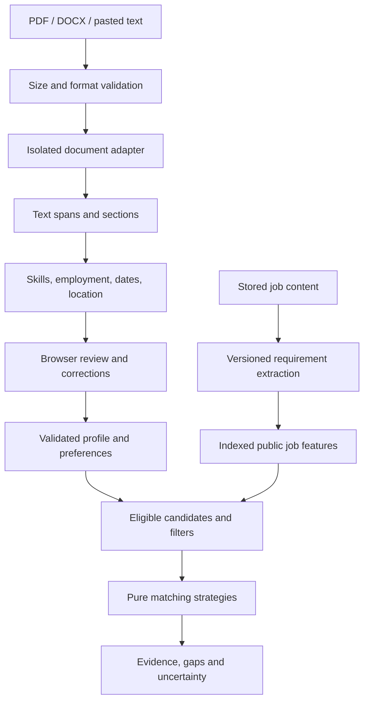

# Resume analysis and job matching plan

**Status:** Pasted-text increment implemented for steps 1–4: synthetic evaluation corpus, reading preview, skill/competency review, employment/location and overlap-safe experience. PDF/DOCX, job enrichment and matching remain proposed. Recorded 1 October 2026, Europe/Amsterdam. Start with [the increment testing guide](docs/RESUME_TESTING.md).

## 1. Product goal

Let a candidate upload a resume, inspect the information Jobbely can actually read, correct the extracted profile, and discover relevant jobs already stored in the database. Show the evidence and uncertainty behind each recommendation.

Keep the existing TypeScript frontend/backend separation and the current preference for no AI. The first release uses document parsers, curated dictionaries and deterministic rules. It requires no paid resume service, external profile enrichment, embeddings or MCP dependency.

The product has three distinct outputs:

1. **Reading preview:** extracted text, reading order, detected sections and parsing problems.
2. **Candidate profile:** evidenced skills, competencies, employment, experience intervals, employer recognition and confirmed location/preferences.
3. **Job matches:** fit by requirement, evidence gaps, location constraints, source freshness and original application links.

Call the first output an **ATS-style reading preview**. It shows our parser's interpretation, not an exact simulation of Greenhouse, Workday or every ATS. Greenhouse documents partial parses caused by image-only files, columns, tables and header/footer content; this supports showing recoverable reading problems rather than claiming a universal ATS score. [Greenhouse's parsing guidance](https://support.greenhouse.io/hc/en-us/articles/200989175-Unsuccessful-resume-parse).

## 2. Current foundation and missing capabilities

| Existing capability                                                                     | Implication for this feature                                                  |
| --------------------------------------------------------------------------------------- | ----------------------------------------------------------------------------- |
| Canonical descriptions, titles, departments, categories, locations and workplace labels | Inputs for a new job-requirements projection; keep upstream evidence          |
| Stable posting IDs, content hashes and dataset versions                                 | Cache requirements by content/policy version and invalidate changed matches   |
| Active/closed lifecycle and source coverage                                             | Filter recommendations and display availability uncertainty                   |
| PostgreSQL, Prisma and separate API/worker processes                                    | Reuse deployment and job ingestion; isolate expensive document parsing        |
| Pure classification policies and ports/adapters                                         | Add resume adapters and matching strategies within the same layer rules       |
| Generated OpenAPI frontend types                                                        | Extend the public contract when implementing the feature                      |
| Catalog reads currently load a full snapshot into memory                                | Add indexed feature queries before exposing matching across the full database |
| No accounts, upload endpoints, skill taxonomy or candidate storage                      | These are new boundaries, not existing functionality                          |

An `active` stored posting is not proof it is still accepting applications. Candidate sources cannot close jobs through absence, so previously imported listings can persist after upstream changes. Matching must respect [LIFECYCLE](docs/LIFECYCLE.md) and [SOURCES](docs/SOURCES.md), not call every stored active record a confirmed open vacancy.

## 3. MVP boundaries

| Include in the first release                                              | Defer                                                                            |
| ------------------------------------------------------------------------- | -------------------------------------------------------------------------------- |
| Text-based PDF, DOCX and pasted text; English extraction rules            | Scanned-image OCR, image uploads, legacy DOC, password-protected documents       |
| Extracted text/reading order, structured fields and parsing warnings      | Exact vendor ATS emulation, pass/fail or hiring-probability claims               |
| Editable employment dates, skills, competencies, education and location   | Automatic verification of claims or inferred personality/proficiency             |
| Total and relevant experience with overlap-safe calculations              | Automatically attributing every year of employment to every skill                |
| Known-employer alias recognition and optional bounded context weighting   | External employer reputation scores or scraped candidate profiles                |
| Required/preferred/contextual job skills, experience and location rules   | General multilingual semantic reasoning and comprehensive worldwide geocoding    |
| Explained matching against eligible stored listings                       | In-app applications, recruiter ranking or automated hiring decisions             |
| Private analysis in the current browser tab, no accounts or saved resumes | Persistent candidate profiles, upload history, alerts and cloud document storage |
| Versioned vocabularies, behavior tests and evaluation corpus              | LLM fallback, vector database and microservices                                  |

Skills coverage starts with approximately 300–500 reviewed concepts across the existing function taxonomy, prioritizing engineering, data/AI, product, sales and people roles. Other functions remain browsable but must show limited extraction coverage until evaluated. Keep unrecognized terms visible for correction. This is a supported vocabulary, not a promise to detect every possible skill.

Competencies such as leadership, stakeholder communication and delivery ownership require explicit supporting statements. A phrase like "managed a team of six" can support a leadership signal; a company name or title alone cannot establish competence. Skill mentions and self-reported achievements are evidence of a resume claim, not independent proof of ability.

## 4. Candidate journey and interface

Add a simple **Resume** entry beside Jobs and Companies. Follow the existing typography, palette, spacing and accessible form patterns in [DESIGN](docs/DESIGN.md).

1. **Input:** choose PDF/DOCX or paste text. Explain supported formats and that the server processes the content temporarily without saving a resume. Show errors before abandoning the user's input.
2. **Reading preview:** show extracted text in parser order beside a structured profile. Label section boundaries, suspicious column order, missing text and uncertain date associations. PDF source viewing/highlights are a later enhancement; MVP uses text evidence excerpts and page references where available.
3. **Review:** let the candidate correct employers, role titles, dates, skills, competencies, current location and desired work locations. Distinguish extracted, uncertain and user-confirmed values. Corrections update the profile; the original extraction remains available in tab memory for comparison.
4. **Preferences:** confirm desired functions, remote/hybrid/onsite, relocation, target locations and optional company-context weighting. An employer's historical location is not the candidate's current location. Do not infer work authorization from address or nationality.
5. **Matches:** list jobs with a fit breakdown, required/preferred skills, experience comparison and location compatibility. Open a detail panel explaining each factor with candidate and job excerpts. Keep current category/company filters and original apply links.
6. **Clear:** a visible action clears the file, extracted text, profile, preferences and results. Reloading or closing the tab also loses this private state. Explain this before upload so the loss is expected.

Keep parsing diagnostics, match fit and evidence completeness separate. Do not put one large "ATS score" above the resume. Show "required skills not evidenced" rather than declaring that the candidate lacks them.

## 5. Proposed processing flow



Candidate analysis and job ingestion remain independent. Uploading a resume never crawls company websites. Requirement enrichment runs from stored job text after successful publication and can backfill existing postings. Its failures do not roll back an otherwise valid source import; an unenriched/obsolete job has limited matching evidence until its projection catches up.

## 6. Resume extraction

Use separate PDF, DOCX and text adapters behind a small `ResumeDocumentExtractor` port. Output a common document containing text spans, reading order, section hints, parser warnings and source references. Keep format-specific internals in infrastructure; use pure functions for profile interpretation.

Evaluate `pdfjs-dist` as the PDF adapter and Mammoth as the DOCX adapter in an initial Node 24 spike. PDF.js supplies a display API and Node examples; it is not a ready-made resume parser. DOCX extraction should retain paragraph/heading evidence, not render arbitrary converted HTML. Mammoth explicitly warns that it does not sanitize content and can exhibit pathological performance. Keep external file access disabled and run conversion with enforced resource limits. [PDF.js documentation](https://mozilla.github.io/pdf.js/getting_started/), [Mammoth documentation](https://github.com/mwilliamson/mammoth.js).

Parser choice is provisional until the fixture spike passes. Pin the selected dependency versions and retain regression fixtures when updating them.

### Evidence and normalization

Every extracted field carries its original text, a source span/page or paragraph reference, rule ID, parser/policy version, status and reason for uncertainty. Offsets refer to a retained normalized text representation; preserve an offset map when Unicode/whitespace normalization changes positions. Do not attach offsets from edited text to the original document.

Recognize section headings and employment blocks before interpreting isolated terms. Preserve ambiguous associations for review. Do not guess a person's name from the email address. Contact extraction is display-only and excluded from matching.

Use canonical skill IDs with curated aliases and case/boundary rules. `TypeScript` and `TS` may map to the same concept in a technology context; `Java` must not match `JavaScript`, and `Go`, `R`, `C`, `React` and `X` require context. Record skills-list mentions separately from project/work evidence. Repeating keywords must not increase strength. Negative statements and "currently learning" are separate statuses, not equivalent to work experience.

ESCO is a candidate source for occupation/skill identifiers and vocabulary expansion. Import a reviewed, versioned subset with attribution/license checks rather than calling an external API for each private resume. Its taxonomy does not replace context extraction or prove mastery. [European Commission ESCO API](https://esco.ec.europa.eu/en/about-esco/escopedia/escopedia/esco-api).

### Experience calculation

- Store dates as intervals with day/month/year precision and explicit uncertainty. "Present" uses a fixed analysis date returned with the result, not a changing system clock during ranking.
- Calculate total dated employment using the union of intervals. Overlapping jobs, consulting contracts and internal promotions must not double-count calendar time.
- Separate employment, internships, projects, volunteering and education. Default professional experience excludes education/projects; internships remain visible as a separate subtotal with an explicit inclusion option.
- Calculate relevant experience by the union of employment intervals whose role evidence supports the requested function. Skill-specific years require explicit dated use or candidate confirmation, not a skill keyword anywhere in that role.
- Year-only or partial dates produce ranges; missing/ambiguous dates remain unknown. Do not turn missing start dates into zero years. A claim such as "10 years' experience" is shown separately from the dated calculation.
- Validate future dates, reversed ranges, ambiguous numeric formats and intervals beyond the analysis date. Warn about gaps as chronology information without penalizing them.

Example with exact boundary dates: 1 January 2020–1 January 2023 and 1 January 2022–1 January 2024 produce **four elapsed years**, not five. If only the first role evidences backend work, relevant backend experience is three years; Python years remain unknown unless specifically dated or confirmed. For month-only dates, adopt half-open month intervals with an explicitly documented inclusive end-month convention before displaying precise totals.

### Employers and location

Recognize employers through a versioned alias registry; start with the 60 target companies and allow unknown employers as ordinary experience. Matching aliases only inside employment fields prevents `Amazon Web Services` in a skills list from becoming employment at Amazon. Consultancy client work remains distinct from direct employment. Acquisition/parent brands and ambiguous names require reviewed mappings rather than automatic merges.

Current location comes from a candidate header/address or manual confirmation; work-entry locations remain attached to those entries. Normalize reviewed city/country aliases, retain the original text and ask about ambiguity such as "Cambridge". Remote does not automatically mean work from any country. Keep willingness to relocate and legal eligibility as separate, user-provided information.

## 7. Job requirements and matching

Build a separate `JobFeatureProjection` keyed by `(postingId, contentHash, requirementsVersion, vocabularyVersion)`. Extract canonical skills, required/preferred/contextual status, alternatives, experience constraints, function/seniority hints, qualifications and geography restrictions. Preserve the job excerpt and rule for each result. Existing job-board adapters should not grow candidate-matching logic.

Distinguish "we use Python" from "must have Python", "3 years with Python" from "5 years overall", and "Java or Kotlin" from requiring both. Unclassified requirements stay unknown. A degree with an experience-equivalence clause must not become an unconditional degree requirement.

The proposed scoring policy, examples, unknown handling, freshness rules and employer weights are specified in [MATCHING](docs/MATCHING.md). Baseline dimensions are skills 50%, experience 20%, role/function 15%, location 10% and explicit qualifications 5%. These are starting product weights to calibrate, not empirically validated hiring predictors.

Default recommendations use stored active postings from a source with a successful complete observation within the existing 36-hour freshness window. Candidate feeds remain labeled partial and availability unconfirmed. Latest failed, stale or removal-quarantined sources are excluded from default ranking but can be viewed separately with a freshness notice. Closed jobs and synthetic records never enter real recommendations. Recheck status when a detail opens; a match never guarantees availability or sponsorship.

Company recognition is displayed by default. **Optional employer-context weighting is off by default and capped at five points**, using explicit versioned employer/domain mappings and relevant dated employment. It may reorder jobs within the same fit band; it cannot override unmet requirements or move a candidate into a stronger fit band. Company recognition is not proof of competence. The UI always shows the base fit and the separate context adjustment.

## 8. API, storage and operations

Propose two stateless POST endpoints:

| Endpoint                  | Proposed behavior                                                                                                                         |
| ------------------------- | ----------------------------------------------------------------------------------------------------------------------------------------- |
| `/api/v1/resume-analysis` | One bounded multipart PDF/DOCX or JSON text input; returns document preview, extracted profile, evidence, warnings and versions           |
| `/api/v1/job-matches`     | Validated corrected profile, preferences, requested policy and optional cursor; returns ranked jobs, breakdowns and evidence completeness |

Use Fastify/TypeBox schemas and generated frontend contracts. Public errors distinguish unsupported format, oversized input, unreadable/image-only documents, invalid profile, capacity limit, parsing timeout and stale matching cursor. Processing is bounded and synchronous in MVP; no private document enters pg-boss or a durable queue. A parser subprocess can be cancelled/terminated without blocking the API event loop.

Keep raw files only in memory while parsing and candidate state in current-tab React memory. No candidate tables, resume object storage, localStorage, IndexedDB, analytics payloads or content-bearing logs. Matching receives only the allowlisted profile fields needed for fit; contact details and full resume text stay out of that request. Stateless recomputation after edits is intentional; saved profiles require a later authenticated design. See [RESUME_PRIVACY](docs/RESUME_PRIVACY.md).

Persist only public job requirement features in PostgreSQL. Add migrations, typed query indexes, bounded reads, a backfill/enrichment command and policy-version invalidation. Do not add resume features to source identity/content hashes or mutate original posting payloads. A projection content hash must match the currently published job version before ranking it.

Match pagination binds dataset version, job-feature generation, analysis date, profile/preferences fingerprint and policy versions. Use opaque signed cursors returned in response bodies and submitted in POST bodies. Reject mismatches/expired cursors rather than mixing results across edits or updates. No private information belongs in shareable URLs or a cursor payload.

## 9. Architecture and maintainability

Use a feature boundary inside the existing modular monolith. Format adapters are interchangeable infrastructure; skill/competency/experience/requirement policies are pure domain functions. An application service orchestrates extraction and ranking, while API routes validate/serialize and frontend components handle review. Add a port only for an actual boundary such as document extraction or indexed job queries.

Proposed additions, not current files:

```text
backend/src/domain/resume/          profile, evidence, skills, chronology
backend/src/domain/matching/        requirements, constraints, score, explanations
backend/src/application/resume/     analyze-resume
backend/src/application/matching/   match-jobs, enrich-job-features
backend/src/ports/resume.ts         document extraction contract
backend/src/ports/job-features.ts   projection/query contract
backend/src/infrastructure/resume/ pdf, docx, text, isolated runner
backend/src/infrastructure/storage/ job feature projection and queries
backend/config/skills.json          versioned vocabulary and aliases
backend/config/employer-context.json reviewed recognition/context mappings
frontend/src/features/resume/       input, preview, review, transient state
frontend/src/features/matching/     preferences, results, explanation components
```

Patterns and invariants belong in [RESUME](docs/RESUME.md), [MATCHING](docs/MATCHING.md) and [RESUME_PRIVACY](docs/RESUME_PRIVACY.md). Avoid a generic NLP framework, inheritance-heavy parser, event bus or AI service introduced only for hypothetical future work. Pin versions, validate config, inject clocks and make tie-breaking deterministic. Update existing architecture/API/storage/security documents when behavior is implemented; this proposal does not claim those changes already exist.

## 10. Delivery phases and completion gates

Estimates assume one experienced full-stack developer and are provisional until the parser/evaluation spike. Allow roughly **four to six working weeks**, with public release dependent on upload isolation and quality gates.

| Phase                 | Work                                                                                                     | Completion gate                                                                                    | Planning estimate |
| --------------------- | -------------------------------------------------------------------------------------------------------- | -------------------------------------------------------------------------------------------------- | ----------------- |
| 0. Evidence and spike | Curate consented/synthetic fixtures; evaluate PDF/DOCX adapters on Node 24; agree vocabulary and metrics | Text/structure extraction works on supported formats; uncertainty and resource limits demonstrated | 2–3 days          |
| 1. Input and preview  | Isolated parsing, POST route, transient state, readable evidence, upload errors                          | One-column and supported two-column samples are reviewable; malformed inputs do not crash API      | 3–4 days          |
| 2. Profile analysis   | Skills/competencies, employer aliases, dates, overlap-safe experience, editable location                 | Grounded fields and corrections pass extraction/chronology corpus                                  | 4–5 days          |
| 3. Job enrichment     | Required/preferred/alternative requirements, projection migration, backfill and indexed query            | Changed descriptions invalidate features; enrichment failures stay explicit                        | 3–4 days          |
| 4. Matching UI        | Constraints, weighted scoring, optional employer context, explanations, versioned pagination             | Every ranked result has reproducible evidence and status; closed/demo jobs excluded                | 4–5 days          |
| 5. Release evaluation | Held-out corpus, privacy/resource tests, realistic load and mobile/browser checks                        | Acceptance targets met; diagnostics and uncertain cases reviewed                                   | 3–4 days          |

Begin with a local end-to-end slice: one text PDF → editable employment/skills → enriched sample of stored jobs → explained matches. Then add DOCX and broader vocabulary, rather than building all abstractions before exercising the flow. Sample jobs used in development remain clearly synthetic and separate from real recommendations.

## 11. Evaluation and acceptance criteria

Create approximately 100 resumes and 120 job descriptions across the initial supported functions, including layout variants, overlapping roles, unrelated skill mentions, remote-country restrictions and sparse descriptions. Use synthetic documents or explicit permission; no scraped applicant resumes. Split by underlying candidate/template/employer description so near-duplicates cannot leak between development and held-out sets. Keep real private fixtures out of Git.

Proposed release targets, not results already achieved:

- On readable English fixtures: at least 95% precision and 85% recall for supported explicit skills; report per-function results, employer/title extraction and competency precision separately.
- At least 95% correct employment/date association on unambiguous dated fixtures. Exact overlap/date edge cases must pass; ambiguous dates must be flagged rather than falsely precise.
- At least 80% precision@10 against manually judged relevant jobs for profiles with enough evidence; report top-10 success and recall separately for sparse profiles and each supported function. Use two reviewers for disputed relevance labels.
- Every extracted requirement and score contribution has source evidence or an explicit user-confirmed value. No inferred proficiency, implicit years of a skill, employer prestige substitute or duplicate keyword boost.
- Adding a supported skill cannot reduce skill coverage; overlapping experience cannot inflate total years; employer weighting cannot override an unmet requirement. Unknowns never become automatic failures.
- Closed jobs are excluded; stale/version-mismatched projections and pagination fail safely. Empty eligible inventory yields a useful coverage message, not fabricated matches.
- Provisional performance targets: p95 analysis within five seconds for common two-page resumes; p95 matching within two seconds on an indexed 50,000-posting benchmark. Hard parse timeout 30 seconds. Specify hardware/concurrency and revise targets after the spike.
- Security tests cover malformed/encrypted PDFs, DOCX archive bombs, external references, hidden/script-like text, oversize inputs, cancellation, isolation/resource exhaustion, and content leakage through logs/errors/cache/URLs.
- Browser tests cover keyboard upload/paste, correction, clearing, abort/race handling, uncertain fields, pagination updates and mobile reading/explanation views.

For implementation, run the root linter after the final code edit, strict types, relevant behavior tests, contract generation and builds. Run dedicated PostgreSQL tests for feature projection/query changes. A default suite that skips database tests does not verify the persistence path. See [QUALITY](docs/QUALITY.md) and [AGENTS.md](AGENTS.md).

## 12. Defaults and later decisions

Proceed with these planning defaults: no AI, English/text-based documents, no saved resumes/accounts, candidate corrections before matching, recognition visible but employer weighting opt-in, unknown eligibility treated as unresolved, and conservative freshness filtering.

Before extending beyond this MVP, decide whether users need saved profiles/alerts, Dutch or other languages, scanned-image OCR, wider role coverage, advanced skill-duration evidence, and tunable employer-context maps. Each expansion needs evaluation and a documented privacy/dependency decision. The five-point employer adjustment and score weights must be calibrated on reviewed examples before public release.
