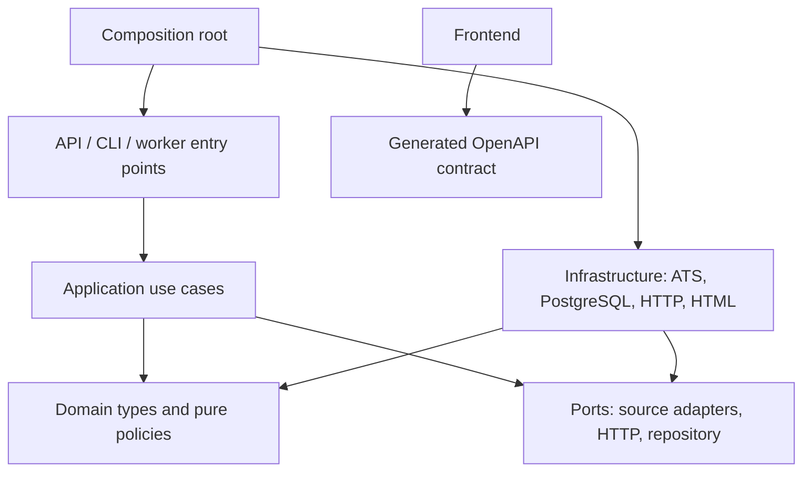

# Architecture and code-quality decisions

This document turns the MVP plan into dependency rules for the first implementation slice. The application is a modular monolith: one backend package with separate API and worker entry points, plus an independently built frontend. New boards extend the ingestion boundary without changing product logic.

**Status:** Implemented for the first slice, recorded 30 September 2026. See [the reference index](README.md) for individual decisions and extension guidance, and [the hosting guide](DEPLOYMENT.md) for runtime configuration.

## Layers and permitted dependencies

- `domain/` contains canonical records, taxonomy, classification and lifecycle policies. No HTTP, Fastify, Prisma, environment variables, or filesystem imports.
- `application/` orchestrates one source run and reading stored data through ports. It chooses policies and controls publication; providers cannot independently close postings.
- `ports/` defines the few genuinely interchangeable boundaries: source adapter, JSON transport, repository, HTML preparation, and pre-publication posting validation. Official-site auditing implements the latter in infrastructure; the application does not fetch pages or read audit files. Avoid interfaces for every internal helper.
- `infrastructure/` implements provider translation, network access, HTML preparation, and database transactions. Upstream schemas stop here.
- `api/` validates public inputs and shapes responses. It does not crawl or contain database queries.
- `bootstrap.ts` is the composition root. Constructor/function arguments wire dependencies explicitly; no service locator or dependency-injection container.
- The frontend imports generated public-contract types, never backend internals. OpenAPI generation detects drift during builds.
- Application code currently uses `node:crypto` for hashes/cursors; this is the one built-in-module exception enforced by the dependency guard. Domain and ports retain their restricted dependency direction.
- Frontend hooks separate URL navigation, abortable catalog loading/pagination, and job-detail loading from rendering. UI components consume public API records rather than provider payloads or database entities.

## Patterns with concrete responsibilities

| Pattern                 | Where applied                                                                             | Why                                                                                                   |
| ----------------------- | ----------------------------------------------------------------------------------------- | ----------------------------------------------------------------------------------------------------- |
| Adapter                 | Greenhouse, Ashby, Lever implementations of `SourceAdapter`                               | Translate different upstream schemas into `ExtractedPosting`; preserve native labels and raw evidence |
| Strategy                | Adapter registry selects source strategy; classification accepts an ordered strategy list | Adding a provider or changing category policies does not require edits throughout the pipeline        |
| Chain of responsibility | Company mapping → global label mapping → specific title rules → unclassified              | First decisive result wins; broad/ambiguous labels defer rather than guess                            |
| Ports and adapters      | Repository/transport contracts with memory/PostgreSQL and fake/real HTTP implementations  | Domain/use-case tests run independently of networks and databases                                     |
| Unit of work            | Repository `commitSnapshot` transaction                                                   | Posting updates, versions, successful run state, and removal reconciliation commit together           |
| Composition root        | Explicit bootstrap wiring                                                                 | Makes runtime mode, dependencies, and test substitution visible                                       |

Consolidation is a shared normalization function plus explicit provider translation, not an inheritance tree. A `BaseScraper` with dozens of optional hooks would couple unrelated providers. Keep pure policies as functions and use composition where behavior varies. Do not add an event bus, CQRS, generic repository framework, or microservices before a concrete requirement calls for them.

## Correctness rules

1. One source run holds a lease. Failed or abandoned runs never reconcile removals. Repository operations must remain safe under retries and overlapping callers.
2. Exhaustive traversal is represented explicitly. Source audit status controls whether absence can close postings; a successful JSON response alone does not establish complete employer scope.
3. Posting IDs, original labels, original dates, and evidence survive normalization. Unknown values remain unknown. `firstSeenAt` is never a publication date.
4. Source-native categories and canonical categories are separate. Classification decisions carry rule/version/evidence and can be replayed without crawling.
5. Each provider validates all list items. A malformed item causes a failed run instead of silently disappearing from the ID set.
6. Distinct source-posting IDs are distinct records. Content hashes detect changes, not identity. Two complete snapshots at least 24 hours apart are required for absence-based closure.
7. A large count collapse quarantines removal reconciliation. It must be investigated or explicitly confirmed, not repeatedly accepted as proof of mass closure.
8. HTTP transport enforces timeouts, retries, host concurrency/pacing, allowed destinations and response-size bounds. Retry behavior is transport policy, not duplicated in every adapter.
9. Raw provider HTML is never a public response. HTML sanitization and readable text extraction happen before persistence/display.
10. Catalog API requests read stored data. The separate resume-analysis POST is stateless bounded text processing; it neither crawls nor persists candidate data. Operator CLI/worker actions perform ingestion. Demo mode contains explicitly labeled synthetic examples and never claims live source health. See [RESUME](RESUME.md).

## Quality gates

- Strict TypeScript, unchecked-index checking, exact optional properties, no explicit `any`, and no unused variables.
- ESLint and formatting, reproducible lockfile, independent package builds, generated contract, deterministic fixtures.
- Architecture test prevents domain/application from importing infrastructure/frameworks.
- Behavior tests cover malformed/empty responses, pagination, unlisted/prospect exclusions, classification conflicts, idempotency, rollback/failure, and stale cursors.
- Live-source audits and PostgreSQL integration are separate gates. Passing fake-transport/memory tests does not verify internet access or database transaction behavior.

## First-slice limitations

The first slice implements the three public API adapters and single-employer source configuration needed by the 10-company cohort. Shared-parent-board membership (Slack/Salesforce), full-text indexed search at scale, regional partition adapters, classification overrides/replay, raw retention cleanup, authentication, and full 60-company source onboarding remain explicit follow-ups. Do not enable unreviewed sources in the scheduled worker or report them as complete.

The PostgreSQL repository is the persistent mode. A memory repository is for tests and a clearly labeled demo only; it is not a production fallback if a database connection fails. Its lease model is intentionally simpler than the persistent repository; independent-client concurrency and lease recovery must be verified against PostgreSQL.

Catalog queries currently load a consistent dataset and filter it in memory, including in persistent mode. The repository boundary makes this replaceable, but the full cohort requires query-oriented repository methods, indexed search, and database pagination before broad ingestion. The API/worker are separate processes within one package; this is not a claim of production-ready throughput or completed deployment.
