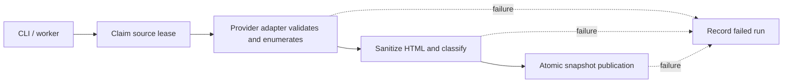

# Decision: application-owned ingestion

**Status:** Manual ingestion implemented; scheduled-worker implementation awaits operational validation. Recorded 30 September 2026.

## Decision and rationale

Public job requirement enrichment is a separate replayable workflow after publication. Operator sync backfills after imports; the worker backfills after a successful sync and schedules a public-feature backfill every 15 minutes. Missing/stale features remain visibly unenriched and do not block or falsify a successful source run. No candidate data enters these queues. See [JOB_FEATURES](JOB_FEATURES.md).

`SyncSource` owns a source refresh. API requests read previously stored jobs; refreshes run through an operator CLI or a separate worker process. This keeps upstream latency and failures outside interactive requests and makes failure behavior reusable across entry points.



After claiming the lease, the use case selects the adapter, invokes its injected `PostingValidation` port, rejects duplicate IDs, prepares HTML/text, rejects empty descriptions, classifies each posting and hashes the normalized content. Verified-source validation repeats official inventory reconciliation and current access-policy checks; candidate imports remain an investigation path. The repository publishes postings, feed/audit evidence, versions and successful run state together. Any extraction/validation/preparation/publication exception records failure and is rethrown. A lease conflict fails before another run is created. See [AUDITING.md](AUDITING.md).

## Commands and scheduling

Since 6 October, [WAVE_REFRESH.md](WAVE_REFRESH.md) adds ordered A → B → C sync plus automatic employer audits. Docker ingestion opts into this mode; it requests one cycle on startup and at 00:00/12:00 UTC, suppresses overlaps globally and persists progress in `ingestion-data`. Candidate wave imports remain partial and do not change activation or closure eligibility. The per-source worker behavior below applies when `INGESTION_WAVE_SYNC` is disabled.

From the repository root:

```sh
pnpm --filter @jobbely/backend run sync --company openai
pnpm sync:wave-a
pnpm sync:wave-b
pnpm sync:wave-c
pnpm --filter @jobbely/backend run sync --all-enabled
pnpm --filter @jobbely/backend run worker
```

Manual sync requires PostgreSQL mode. `--company` and `--wave` include configured candidate boards for evaluation; `--all-enabled` selects scheduled sources. Choose exactly one selector. One company may have multiple boards, synchronized separately. The CLI continues after a source error and exits unsuccessfully if any source failed.

Wave C currently selects its five configured priorities plus the configured Atlassian, Shopify, HubSpot and ServiceNow backlog expansions. Apple requires a full initial detail traversal, potentially over 100 minutes at default pacing; inventory diagnostics or samples cannot publish jobs. Native source errors and access gates preserve existing data. See [WAVE_C.md](WAVE_C.md).

The worker uses pg-boss in the same PostgreSQL database, with local concurrency one, keyed source schedules, UTC refreshes at staggered minutes every 12 hours, and a configured two retries with backoff. It rechecks audit/enabled state before processing a job. The source lease is the cross-process overlap guard; local concurrency alone is not.

## Invariants, tradeoffs and limits

Failed runs never reconcile removals or publish partial updates. Last successful listings remain readable. Quarantine affects removal reconciliation; valid observed postings still update. Successful snapshots retain raw evidence; failed runs currently retain an error summary rather than their fetched payloads.

All candidate sources are currently unscheduled. `SyncSource` renews ownership every minute during long extraction/validation; renewal failures prevent publication and cleanup stops the heartbeat. Workday extraction has a two-hour budget and the worker queue has a three-hour job lifetime. Queue restart/retry behavior and schedule removal when disabling a source still need operational verification. Registry changes require process restart. The worker is not started by `pnpm dev` or the API entry point. SIGINT/SIGTERM trigger queue shutdown and repository closure.

## Implementation and verification

[Use case](../backend/src/application/sync-source.ts), [behavior tests](../backend/src/application/sync-source.test.ts), [CLI](../backend/src/cli/sync.ts), [worker](../backend/src/worker/main.ts). Publication and expiry belong to [STORAGE.md](STORAGE.md); closure belongs to [LIFECYCLE.md](LIFECYCLE.md).
