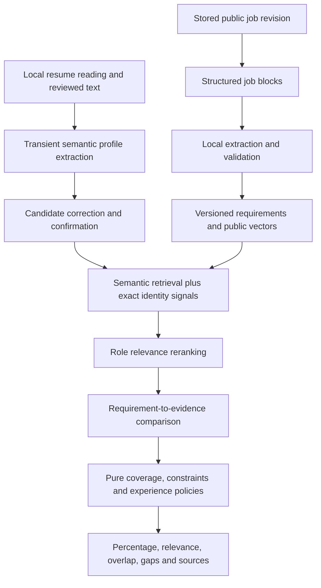

# Plan: semantic resume matching rework

**Status:** Implementation started, 4 October 2026, Europe/Amsterdam. [SEMANTIC_EXPERIMENTS](SEMANTIC_EXPERIMENTS.md) records the first foundation: development evaluation, requirement/evidence contracts, pure coverage algebra and a local-model public-job shadow adapter. Live matching behavior remains unchanged; no actual model inference or independent held-out benchmark has run.

**Deployment decision:** Inference runs on the Jobbely backend host, as selected by the user. Available production RAM, GPU, concurrency and latency budget are not established yet.

**Quality refinement, 9 October 2026:** [ATS_QUALITY_PLAN](ATS_QUALITY_PLAN.md) diagnoses the Airbnb sparse-perfect-score failure, compares rules, compact NLP, language-model and hybrid strategies, and defines independent labels, uncertainty-aware scoring and proposed quantitative release gates. It refines this roadmap; the benchmark/model selection and live replacement remain unfinished.

**Execution authority:** This is the implementation roadmap for the new matching work. It supersedes the remaining delivery sequence in [LLM_MATCHING](LLM_MATCHING.md) and [SEMANTIC_MATCHING_PLAN](SEMANTIC_MATCHING_PLAN.md), while retaining their historical diagnoses. [STRUCTURED_MATCHING](STRUCTURED_MATCHING.md), [MATCHING](MATCHING.md) and [RESUME_PRIVACY](RESUME_PRIVACY.md) continue to describe implemented behavior until explicitly updated alongside code.

## 1. Outcome and scope

Match the meaning of a candidate's work to the meaning of each job: activities, tools, technical scope, domain, responsibility, seniority and explicit requirements. Present an explained qualification-coverage percentage, separate role relevance and skill overlap, and unresolved eligibility. A percentage describes our comparison of available evidence; it is not a universal ATS score or a probability of interview, employment or applicant success.

The user has authorized implementing a substantial replacement of matching. Existing aliases, graph weights and score dimensions are replaceable. Preserve the useful foundations: public-job ingestion, stable identities, original descriptions, availability gates, bounded document reading, transient candidate state, review/correction, generated contracts and projection publication races. Collection and catalog categorization remain deterministic; semantic enrichment is a separate matching concern.

Start with pretrained machine-learning models. Do not train a model from scratch or fine-tune on the current synthetic regression suite. Consider supervised ranking or fine-tuning only after independent labels establish a persistent error pattern and enough suitable development data exists.

## 2. Reviewed current process

The review includes the current working tree, which contains substantial uncommitted resume/matching changes and new structured-document files. These changes belong to the existing work and must survive implementation. Previous dated documentation results are not new verification.

| Stage                     | Current implementation                                                                                              | Consequence                                                                                                    |
| ------------------------- | ------------------------------------------------------------------------------------------------------------------- | -------------------------------------------------------------------------------------------------------------- |
| File reading              | Browser PDF.js / DOCX worker produces bounded text, reading blocks and warnings                                     | Useful isolation and review; layouts remain heuristic and OCR is absent                                        |
| Resume analysis           | `AnalyzeResume` detects employment, dates and location, then uses shared concept aliases and phrase rules           | Recognizes a curated set of activities, not general sentence meaning                                           |
| Profile                   | Signals aggregate by concept ID; facets and at most five evidence references retain source/action/outcome/assertion | Different activities and contexts become one skill claim; fine detail can be lost                              |
| Public job interpretation | Structured headings/blocks feed English importance, alternatives, tenure and constraint rules                       | Useful required/preferred/context separation, but unknown grammar and open vocabulary still depend on patterns |
| Features                  | Versioned public `JobFeature` JSON is backfilled and published under content-hash/locking guards                    | Appropriate place to add expensive public enrichment once per revision                                         |
| Match request             | Strict allowlist sends concepts, statuses, facets, evidence metadata, employment category/dates and location        | Full resume text is excluded; role titles and unrestricted sentence meaning are unavailable to ranking         |
| Evidence comparison       | `projectSkills` uses direct status/facet credit and a reviewed two-hop weighted graph                               | Related evidence is inferred from a concept, not assessed against the specific job activity                    |
| Score                     | Skills 50, experience 20, function 15, location 10; qualification weight 5 remains unassessed                       | Fixed policy has no held-out calibration and renormalizes over assessed dimensions                             |
| Ranking                   | All eligible enriched jobs are rescored in 250-row batches; top page retained, bands sorted first                   | Bounded and private, but unsuitable for adding expensive model calls inside every-job scoring                  |
| UI                        | Review gate, evidence colors, source references, completeness, gaps, original descriptions and signed pagination    | Good explanation foundation; large numeric fit remains easy to misread                                         |

### Specific code findings

- [Recognition](../backend/src/domain/semantics/recognize.ts) builds regular expressions from the concept registry and explicit phrase rules. The engineering expansion is still a finite language policy.
- [Candidate extraction](../backend/src/domain/resume/vocabulary.ts) creates richer references, but [scoring](../backend/src/domain/matching/score.ts) mainly selects a matching concept/facet and copies those references into explanations. Candidate action, outcome and assertion metadata do not drive a requirement-specific comparison.
- [Requirements](../backend/src/domain/matching/requirements.ts) stores clause action, modality, polarity and all-of/any-of metadata. Scoring consumes flattened skill groups and tenure/constraint lists, not the full clause algebra. Recording a conditional statement does not implement conditional evaluation.
- The graph compares generalized concept relationships. It cannot reliably distinguish operating a distributed database from building its storage engine, or Python automation from Python production-service development.
- Function fit uses any reviewed professional role in a broad category. Ranking cannot use the omitted role title, task-specific depth, role recency or scoped evidence duration. Skills can aggregate across unrelated roles/projects.
- Experience below a threshold can receive fractional credit; required and preferred experience thresholds are averaged equally in the experience dimension. Qualifications remain unresolved; location is exact normalized overlap. These policies should be replaced deliberately, not mistaken for calibrated ATS behavior.
- `baseScore` divides by assessed weight. Missing/unresolved dimensions can disappear from that denominator. `completeness` is an assessed-policy fraction, not the fraction of the employer's actual obligations correctly interpreted. Review bands mitigate some cases but do not repair the numeric meaning.
- Current comparison endpoints re-extract deterministic requirements on demand. Once extraction involves a model, ranking and single-job comparison must share the same selected public feature revision.
- The repository category filter precedes ranking. Semantic relevance cannot recover a relevant job excluded by a coarse category. Keep explicit user filters, but distinguish them from inferred category hints.

### Reproduced synthetic observations on 4 October

Probes ran the current TypeScript analysis/extraction/scoring code with fictional employers and profiles; no candidate data was used or stored.

| Synthetic input                                                                                                       | Observed result                                         |
| --------------------------------------------------------------------------------------------------------------------- | ------------------------------------------------------- |
| “Reduced request latency by 40%.”                                                                                     | `low-latency` and `performance-optimization` extracted  |
| “Made the slowest customer requests complete in half the previous time.”                                              | No skill claims extracted                               |
| “Implemented automatic failover between replicas.”                                                                    | `failover` and `fault-tolerance` extracted              |
| “When a machine stopped responding, traffic moved to a healthy replica without interruption.”                         | No skill claims extracted                               |
| One required Python skill; engineering employment plus Python services, image-model training, or financial automation | Each returned score 100, completeness 65, band `strong` |

The Python example alone does not prove an incorrect Python-skill decision: all three profiles claim Python use. It demonstrates that the headline score cannot establish broader backend relevance from a sparse job and that these contexts have no effect on this comparison. New benchmarks must explicitly label job task/domain distinctions.

## 3. Proposed architecture

Use a hybrid system with distinct responsibilities. Machine learning supplies semantic representations and evidence proposals; pure policies decide requirement logic, credit, experience and explanation.

### Retrieval, reranking, extraction and RAG

1. **Embeddings:** Encode bounded task/capability blocks and role summaries to retrieve jobs or candidate evidence despite different wording. Exact technical names remain useful alongside semantics. Whole-document vectors alone can hide one crucial requirement.
2. **Cross-encoder reranker:** Compare a shortlisted role with relevant candidate propositions to improve ordering. Its relevance output does not establish that each obligation is satisfied. The [Sentence Transformers retrieve/rerank reference](https://sbert.net/examples/sentence_transformer/applications/retrieve_rerank/README.html) describes this two-stage design.
3. **Small instruction model:** Extract activities and requirement logic with source references; optionally classify ambiguous evidence pairs as supported, partial, contradicted or unknown. It never chooses the final percentage. Schema-valid output still needs semantic evaluation.
4. **Retrieval-augmented grounding:** Retrieve relevant resume propositions, public requirement blocks and pinned concept definitions for a bounded comparison. This is the useful RAG component. Do not build a chatbot or retrieve arbitrary internet information about the candidate.

During experiments, test all-pairs evidence comparison on small documents before retrieval. If retrieval drops the supporting sentence, a better comparator cannot recover it. At catalog scale, maintain an exhaustive cheap baseline and measure shortlist recall before replacing full scanning.

### Initial model shortlist

These are benchmark candidates, not selected production dependencies or claims of job-matching accuracy. Model pages were checked on 4 October 2026.

| Responsibility                             | Initial candidate                                                                 | Decision criterion                                                                             |
| ------------------------------------------ | --------------------------------------------------------------------------------- | ---------------------------------------------------------------------------------------------- |
| Cheap sentence-vector baseline             | [all-MiniLM-L6-v2](https://huggingface.co/sentence-transformers/all-MiniLM-L6-v2) | Establish a low-cost baseline; chunk to its input limit rather than embedding a full resume    |
| Semantic retrieval                         | [Qwen3-Embedding-0.6B](https://huggingface.co/Qwen/Qwen3-Embedding-0.6B)          | Test domain/paraphrase recall and cost with task instructions and pinned vector dimensions     |
| Relevance reranking                        | [Qwen3-Reranker-0.6B](https://huggingface.co/Qwen/Qwen3-Reranker-0.6B)            | Test ordering gains over embeddings and a compact cross-encoder baseline                       |
| Structured extraction / bounded comparison | [Qwen3-4B-Instruct-2507](https://huggingface.co/Qwen/Qwen3-4B-Instruct-2507)      | Test instruction adherence, abstention, domain scope and resource use at a pinned quantization |

Prototype extraction through an infrastructure adapter for a local inference runtime. [Ollama structured outputs](https://docs.ollama.com/capabilities/structured-outputs) supports schema-constrained responses. Verify the exact chosen runtime/model combination; an Ollama extractor and an embedding/reranker service need not share a runtime. Avoid introducing multiple production services until the experiment establishes a benefit.

Measure memory, token throughput, warm/cold latency and concurrency on the target backend host. Do not equate parameter count with RAM/VRAM requirements; weights, context cache, batch size and simultaneous models matter. A 4B model may be inadequate; promote a larger candidate only if the quality improvement fits the measured deployment budget. No model weights, runtime, Docker service or dependency was installed during this review.

## 4. Evidence contracts to replace the skill bag

### Public job requirements

Preserve each original block and produce explicit, independently addressable requirements with:

- Required/preferred/context importance, candidate-versus-employer actor, action, object/capability, mechanism, technical domain and tool/facet.
- Required level/depth and responsibility where actually stated; unknown otherwise.
- An expression tree for all-of, any-of, equivalent routes, conditions and exclusions. Nested degree-or-experience routes must survive as alternatives.
- Numeric thresholds attached to the relevant professional/function/activity scope, with exact units and source evidence.
- Location, workplace, authorization, language and qualification constraints kept separate from skill similarity.
- Exact source block/span, extractor identity, validation outcome and unresolved fragments. Unknown concepts retain bounded descriptive labels; canonical-ID membership cannot be the gate for recognizing meaning.

Clause splitting and duplicate handling must be semantic. “Design and operate resilient services” is not several independent obligations merely because it emits several related tags. Conversely, a genuinely compound requirement cannot be satisfied by its easiest part.

### Candidate propositions

Retain activities per evidence block and role/project, rather than replacing them with one concept status:

- Actor/assertion: performed, assisted, observed, learned, negated, listed or explicitly reviewed.
- Action, object, mechanism, outcome, domain, tools, environment and depth, each tied to supporting spans.
- Role identity and bounded role descriptor; professional/project/volunteer context, dates, responsibility and optional reviewed activity intervals.
- Original source references and extraction provenance distinct from the candidate's later corrections.
- Open-vocabulary descriptors plus canonical concepts where appropriate. An unknown technology or paraphrase must remain comparable without first adding a regex.

Store raw text/excerpts only in transient analysis and browser memory. Matching can consume bounded reviewed propositions, normalized descriptors and references; candidate embeddings stay in request memory. Extending this allowlist is a deliberate API/privacy decision: even normalized propositions and vectors are private data. Do not smuggle free-form document text through existing IDs or reference fields.

Validate source references during analysis, when the text is available. Subsequent stateless matching treats the submitted profile as a reviewed self-report, not authenticated employment history. A model cannot certify its own interpretation by inventing a provenance label.

### Pair decisions

Compare one requirement to bounded relevant evidence and return a semantic decision plus source references:

| Decision               | Meaning                                                                       | Credit policy                                        |
| ---------------------- | ----------------------------------------------------------------------------- | ---------------------------------------------------- |
| Supported              | Evidence addresses the stated activity, scope and required facets             | Full credit for the assessed requirement             |
| Partial / transferable | Useful overlap, but depth, mechanism, scope or some conjunct is unestablished | Explicit capped partial credit; required gap remains |
| Not evidenced          | No supporting claim found in the reviewed profile                             | Zero evidence credit; do not claim inability         |
| Contradicted / denied  | Candidate explicitly denies the required claim                                | Zero; inference cannot override it                   |
| Unknown                | Requirement or evidence interpretation is unresolved                          | Abstain, show review and an uncertainty interval     |
| Suggested              | Potential unmentioned skill worth a scoped question                           | Zero until candidate answers and reviews             |

An exact tool name cannot bypass assertion or scope checks. A close vector is a retrieval hint. Supported semantic paraphrases can receive full credit after the evidence-comparison policy is validated; they remain labeled as inferred interpretation. Neither graph paths nor semantic support establish activity-specific years. Use independently reviewed intervals and overlap-safe date arithmetic for tenure.

## 5. Percentages, relevance and ranking

Replace the current renormalized base score. Define three visible outputs with different meanings:

1. **Required qualification coverage:** weighted evidence coverage of the interpreted mandatory requirements, with supported/partial/not-evidenced/unknown counts.
2. **Preferred qualification coverage and skill overlap:** separate coverage of nice-to-haves, plus direct, semantically supported and transferable overlap. Denominator and alternative-group treatment must be visible.
3. **Role relevance:** ranked suitability of activities/domain/responsibility; initially a descriptive band or ordering signal. Do not convert cosine or a raw reranker logit into a percentage.

For a fully interpreted requirement set, coverage is `100 × sum(weight × evidenceCredit) / sum(weight)`. Each distinct obligation contributes once; any-of chooses its supported route and all-of requires its constituent obligations. Begin with equal distinct-obligation weights and a documented partial-credit policy, then evaluate sensitivity. Any later emphasis weights require rationale and labels, not presumed employer preferences.

Example: eight equal required qualifications, four supported, two partial at 0.5 and two not evidenced gives 62.5% required evidence coverage. This arithmetic is a proposed policy illustration, not model confidence. Preferred qualifications do not inflate that number or remove mandatory gaps.

Unknown requirements remain in the denominator when their obligation structure is known. Calculate a conservative lower bound with unknown credit 0 and an upper bound with unknown credit 1, labeled as a coverage range. When block reading or obligation segmentation is too incomplete to know the denominator, suppress the headline percentage and show “Needs review” plus the assessed counts. No requirements means no coverage percentage. Unknown does not silently vanish, become a proved failure, or get duplicated once per unresolved word.

Report interpretation coverage separately from candidate evidence coverage, using explicit clause counts and flags. It is a diagnostic measure of the interpreted document, not extraction accuracy. Launch completeness gates must be validated against held-out labels rather than reusing the current 60-point rule without evidence.

Eligibility is met / explicitly incompatible / unknown, evaluated separately. Unknown authorization is not rejection. Explicit user filters may exclude jobs, with the reason shown. Role-level tenure must not satisfy skill tenure. Keep recent evidence as a relevance factor where justified; do not erase transferable experience or infer skill decay from age.

Use assessed eligibility and required evidence first, then relevance and preferred coverage, with stable ID tie-breakers. Preserve an exploratory view for transferable roles and an independent review state so an unfamiliar but promising role is not automatically buried beneath known-vocabulary jobs. Remove same-employer bonus from the new default ranking; preserve the legacy option only while maintaining the old mode. Employer names must not become semantic prestige signals.

Do not train a hiring-probability score without suitable outcome data. Initial calibration targets human relevance ordering and evidence decisions. Future supervised models may learn ranking from consented labels; explainable coverage remains policy-controlled.

## 6. Execution sequence and acceptance gates

Follow the order below. Record the selected models, measured results, changed files and unmet gates before marking a phase complete. Failed gates lead to a documented change of model/design, not weaker tests or a larger score.

### Phase 0 — Reproducible baseline and evaluation design

- [ ] Record the current working-tree diff without overwriting it; use a separate named implementation branch when implementation begins. Pin the baseline feature/scoring versions.
- [ ] Turn the reproduced probes into synthetic behavior cases, including affirmative/negative/assisted contrasts and domain-specific job expectations.
- [ ] Build an evaluation harness that can replay the rules baseline, embeddings, reranking and extraction/comparison variants on identical inputs.
- [ ] Inventory target-host resources and agreed response/backfill budgets. Distinguish the developer workstation from the eventual server.
- [ ] Prepare independent labels for jobs, candidate propositions and graded profile/job relevance; freeze development/validation/test splits before prompt or threshold tuning.

**Gate:** Baseline error report, reproducible input/version manifest, labeling rubric and untouched held-out test split. Passing existing regression tests is baseline compatibility, not semantic quality.

### Phase 1 — Requirement algebra and reviewed evidence model

- [ ] Introduce requirement expressions and per-activity candidate propositions with open descriptors and bounded evidence references.
- [ ] Implement pure expression evaluation, unknown propagation, contradiction precedence, distinct-obligation weighting and scoped tenure.
- [ ] Preserve source block references, role associations and correction lineage across analysis → review → match.
- [ ] Version public schemas and update strict request allowlists; regenerate contracts with `pnpm contracts`.
- [ ] Keep an adapter for legacy rules/features so the current UI remains usable while the new mode is incomplete.

**Gate:** Round-trip logic, equivalent routes, conditional unknowns, assisted/observed claims and corrections behave correctly. Explicit denials cannot become supported; no total-role duration is copied into an activity interval.

### Phase 2 — Public-job extraction experiment

- [ ] Add one semantic extraction port with rules and local-model implementations, wired in bootstrap. Do not put runtime calls in domain policies.
- [ ] Feed bounded blocks with heading/neighbor context, requiring typed claims, logic, unknowns and source evidence.
- [ ] Validate IDs, supported quotes/spans, numeric units, bounds and contradictions; source validity alone is insufficient for semantic support.
- [ ] Run public-job shadow extraction; do not change scores yet. Store experimental public results under a separate strategy identity.
- [ ] Compare requirement precision/recall, alternative/duration accuracy and abstention against the independent labels.

**Gate:** Model meaning extraction improves recall without losing mandatory-clause precision. Reject forged evidence and adversarial instructions; retain unknowns for unsupported interpretations. If no candidate clears the gate, change the model or experiment before production use.

### Phase 3 — Transient profile extraction and review

- [ ] Evaluate synthetic resumes first, including paraphrases without known skill strings, multi-role projects and domain contrasts.
- [ ] Once evidence supports it, expose the semantic mode with a clear statement that inference occurs on the Jobbely host and input is transient.
- [ ] Remove contact/header identity fields before inference; preserve private source mapping locally. Do not redact substantive technical context indiscriminately.
- [ ] Interpret once per document revision; apply skill/date/review corrections without rerunning a costly model on every 350 ms edit.
- [ ] Preserve cancellation, generic errors, review invalidation and explicit rules fallback on failure. A fallback changes mode/provenance and cannot reuse a semantic-mode cursor.

**Gate:** Semantic profile extraction survives assertion/scope contrasts and user correction. Candidate payloads, propositions and embeddings remain absent from logs, queues, caches and storage. Clearing or replacing input cannot restore stale work.

### Phase 4 — Semantic retrieval and role relevance

- [ ] Embed public requirement/role blocks once per feature revision and transient reviewed candidate propositions once per profile revision.
- [ ] Benchmark exact vector search first. Add PostgreSQL vector storage through migrations if it wins on the measured corpus; use a port, not a separate vector database by default.
- [ ] Retrieve from a union of semantic candidates and exact canonical/identifier signals. Exact signals are an auxiliary retrieval path, never qualification proof.
- [ ] Apply source availability, explicit filters and current content/model versions before selection. Category inference is a soft hint unless the user deliberately filters it.
- [ ] Tune shortlist sizes, initially testing 100–300 jobs; rerank a bounded subset using role context. Measure missed relevant jobs, not just latency.

**Gate:** Shortlist recall preserves independently labeled strong/relevant matches across each supported function. [pgvector filtering](https://github.com/pgvector/pgvector#filtering) requires particular care with approximate indexes; compare filtered ANN results to exact retrieval before enabling ANN.

### Phase 5 — Requirement-to-evidence comparison

- [ ] Retrieve a small evidence set per requirement and compare all relevant predicates, including actor, action, mechanism, depth, domain and polarity.
- [ ] Benchmark a compact pair classifier/reranker plus pure rules against bounded instruction-model pair decisions. Relevance and entailment require different labels.
- [ ] Batch comparisons and cap total pairs/tokens/time per request. Test a bounded final candidate set, initially 20–50; these numbers are tuning ranges, not service guarantees.
- [ ] Use deterministic direct decisions when unambiguous; reserve model comparison for unresolved paraphrases/scope. Abstain on rejected output or exhausted budget.
- [ ] Preserve graph-derived transfer only where independently justified. Stop letting a concept relationship stand in for an activity comparison.

**Gate:** Positive paraphrases improve while misleadingly similar, negated, observed and wrong-domain statements do not become supported. Inspect evidence retrieval recall separately from comparator accuracy. No late model score may reorder already returned pages.

### Phase 6 — Scoring and explanation replacement

- [ ] Replace `scoreJob` percentage normalization with required/preferred coverage and explicit unknown treatment.
- [ ] Separate role relevance, qualification interpretation, direct/semantic/transferable overlap, tenure and eligibility in API responses.
- [ ] Show paired job/candidate sources and an explanation for each requirement; keep all three qualification display groups and original descriptions.
- [ ] Add reviewed eligibility fields only for explicitly supported comparisons, such as candidate-entered languages or qualifications. Do not infer authorization from location.
- [ ] Benchmark new ordering and percentage behavior against labels; calibrate any relevance bands using validation data, then evaluate once on the frozen test set.

**Gate:** Sparse or incomplete extraction cannot yield a confident 100% headline. Additional keyword repetition or unrelated employer brands cannot improve fit. Correct domain/role contrasts affect relevance while equivalent paraphrases preserve coverage.

### Phase 7 — Persistent features, pagination and deployment

- [ ] Extend public feature identity with document/extractor/schema/prompt/ontology/validation versions, model weight digest, quantization, vector dimension and comparison/scoring policies.
- [ ] Keep model work outside database transactions; publish only against the current posting hash with the existing lock order. Public enrichment failures must not fail job ingestion.
- [ ] Make backfill resumable and idempotent, with public-only queues and separate pending/failed extraction counts. Measure full-corpus throughput before scheduling model work.
- [ ] Shadow-publish new features alongside legacy features until rollback is proven. Explicitly report rules fallback and incomplete enrichment.
- [ ] Bind cursors to profile revision, dataset/source freshness, feature/model/index generation, retrieval settings and scoring policy.
- [ ] Choose bounded stateless pagination first: freeze a bounded public-job candidate/ordering manifest in a signed token, with no candidate text, vectors or result cache. Enforce token size/expiry and recompute expensive decisions only if replay stability is verified.
- [ ] If deterministic replay cannot preserve ordering, redesign pagination before release: a short-lived in-memory private session is a separate explicit change to the current stateless/privacy contract. Do not silently introduce it.
- [ ] Add model health, timeout, cancellation and resource admission limits. Preserve the 36-hour freshness checks, failed/incomplete-source exclusion and original employer links.

**Gate:** Dedicated PostgreSQL tests prove stale publication rejection, concurrent backfills, projection/index revision consistency and migration/rollback. Cold/warm model and pagination behavior pass measured load budgets. Rank and single-job comparison use identical features/policies.

### Phase 8 — Limited rollout and removal of obsolete scoring

- [ ] Release the validated mode behind a configuration flag, initially for the evaluated role slices; retain clear limited-coverage states elsewhere.
- [ ] Verify desktop/mobile/keyboard review, percentages, colors, explanations, edit invalidation and model-unavailable behavior with fictional profiles.
- [ ] Run `pnpm check`, plus the dedicated PostgreSQL suite and target-host load checks. Publish measured limits and model/feature versions.
- [ ] Retire obsolete score/graph paths once rollback and equivalence boundaries are documented. Consolidate architecture references around implemented behavior.
- [ ] Consider fine-tuning only from a remaining labeled error report; do not make it a prerequisite for useful semantic matching.

**Gate:** Required quality, privacy, contract, database and resource checks pass. A feature flag alone does not excuse misleading percentages or unsupported evidence.

## 7. Evaluation corpus and measurable release criteria

Proposed initial labeling budget: roughly 300 public job descriptions across employers/templates, 120 varied synthetic candidate profiles and 1,200 graded profile/job pairs, plus requirement-to-evidence labels. These are targets for experiment design, not current corpus counts or proof of statistical sufficiency. Include the five currently supported functions and report slices separately; expand domain coverage only as evaluated.

Split by employer/template, candidate history and paraphrase family to prevent development examples leaking into testing. Two independent human reviews should resolve a sampled portion and all disputed or high-impact labels. Model-generated synthetic text is permitted, but the tested model must not be the sole ground-truth labeler. Use public jobs and fictional candidates; no real resume fixtures or payload diagnostics.

| Layer              | Measure                                                     | Provisional gate to validate before rollout                                                      |
| ------------------ | ----------------------------------------------------------- | ------------------------------------------------------------------------------------------------ |
| Reading/structure  | Section/role association and original-span integrity        | Zero invented spans in critical regressions; equivalent document formats preserve meaning        |
| Job interpretation | Required precision/recall; preferred/context confusion      | Target ≥95% required precision and ≥90% recall; report sample counts and uncertainty             |
| Logic/tenure       | Alternative, conjunction, condition and duration accuracy   | Target ≥95%; critical degree-or-experience and activity-tenure cases must pass                   |
| Candidate meaning  | Proposition/assertion/scope precision and recall            | Paraphrase recall improves over rules without increasing unsupported claims                      |
| Retrieval          | Job recall@K and evidence recall@K                          | Target ≥95% of labeled relevant jobs in the chosen shortlist; test critical slices separately    |
| Pair comparison    | Supported precision, contradiction errors and abstention    | Target ≥95% supported precision; zero unsupported support in critical negative regressions       |
| Ordering           | NDCG@10, pairwise preference accuracy and per-role results  | Demonstrated improvement over rules with uncertainty reported and no material slice regression   |
| Percentage         | Agreement with labeled coverage; unknown/sparse behavior    | Correct denominators, stable paraphrases, no confident score on incomplete obligation extraction |
| Operations         | p50/p95, memory, queue throughput, cancel/outage and replay | Set numerical budgets after target-host measurement, before implementation rollout               |

These are proposed quality goals, not achieved results or guaranteed population accuracy. Report coverage/abstention with precision: a model that calls everything unknown cannot pass by producing a few correct positives. Evaluate all candidate/extractor versions on the same held-out inputs. Fine-tuning, prompt tuning and calibration use development/validation data only.

Critical contrasts include tool use versus tool internals, ML model training versus employee onboarding, production services versus finance automation, hands-on work versus observation, project work versus professional tenure, backend reliability versus generic organizational reliability, candidate obligations versus employer aspirations, and explicit denial versus an ecosystem suggestion.

## 8. Implementation map and invariants

| Concern                             | Existing files to change or preserve                                                                                                                                                                                                                                                                                                                                                                        |
| ----------------------------------- | ----------------------------------------------------------------------------------------------------------------------------------------------------------------------------------------------------------------------------------------------------------------------------------------------------------------------------------------------------------------------------------------------------------- |
| Reading and source references       | [resume blocks](../backend/src/domain/resume/blocks.ts), [job document](../backend/src/domain/matching/document.ts), [HTML document reader](../backend/src/infrastructure/job-document.ts), [local documents](../frontend/src/features/resume/documents/reader.ts)                                                                                                                                          |
| Semantic contracts                  | [resume model](../backend/src/domain/resume/model.ts), [propositions](../backend/src/domain/semantics/propositions.ts), [requirements](../backend/src/domain/matching/requirements.ts), [matching model](../backend/src/domain/matching/model.ts)                                                                                                                                                           |
| Orchestration and new runtime ports | [analysis](../backend/src/application/resume/analyze-resume.ts), [backfill](../backend/src/application/resume/job-features.ts), [matching](../backend/src/application/resume/match-jobs.ts), [bootstrap](../backend/src/bootstrap.ts)                                                                                                                                                                       |
| Comparison and percentages          | [score](../backend/src/domain/matching/score.ts), [relations](../backend/src/domain/matching/skill-relations.ts); add pure expression/coverage policies as needed                                                                                                                                                                                                                                           |
| Public feature storage              | [feature port](../backend/src/ports/job-features.ts), [PostgreSQL features](../backend/src/infrastructure/storage/feature-postgres.ts), [Prisma schema](../backend/prisma/schema.prisma), migrations and database race tests                                                                                                                                                                                |
| API and private boundaries          | [resume schemas](../backend/src/api/resume-schemas.ts), [matching schemas](../backend/src/api/matching-schemas.ts), [semantic schemas](../backend/src/api/semantic-schemas.ts), [private routes](../backend/src/api/private-resume-route.ts), generated contracts                                                                                                                                           |
| Review and explanations             | [allowlist](../frontend/src/features/resume/match-profile.ts), [analysis hook](../frontend/src/features/resume/useResumeAnalysis.ts), [workbench](../frontend/src/features/resume/ResumeWorkbench.tsx), [matches](../frontend/src/features/resume/ResumeMatches.tsx), [comparison](../frontend/src/features/resume/JobProfileComparison.tsx), [evidence](../frontend/src/features/resume/MatchEvidence.tsx) |

Keep domain code pure and runtime/network/storage in infrastructure. Add only interchangeable ports justified by the model/retrieval boundary; no agent framework, graph database or generalized workflow platform is required. Regenerate API/Prisma code through existing commands.

The inference service runs on the backend host, not on the candidate's computer. Preserve browser document-worker isolation. Use local-only weights/runtime with private adapter access and no cloud fallback; [Ollama local-only configuration](https://docs.ollama.com/faq#how-do-i-disable-ollama-cloud-features) documents disabling its cloud features. Verify runtime payload logging, diagnostics, caches and egress in the actual deployment.

Treat both resumes and employer descriptions as untrusted data. The extractor has no tools, browsing, filesystem access or application-action capability. Validate outputs and source references, cap inputs/outputs/context/pairs/concurrency, and cancel work. Never persist candidate text, propositions, vectors, fingerprints or private queues. Record aggregate operational counts without payloads. Unavailable inference yields a visibly limited rules mode or review state.

Keep inferred evidence distinguishable from explicit claims and manual confirmation. Suggestions receive zero credit. Model self-confidence, a supporting quote or an exact keyword alone is not qualification proof. Activity-specific tenure requires reviewed activity intervals; employer prestige, demographic identity and contact information do not influence ranking.

## 9. Verification for this planning change

The review ran current source inspection and transient synthetic probes. Focused backend checks passed **297 tests across eight files** covering resume evaluation, semantics, matching, structured requirements, application scanning and API behavior. Frontend resume checks passed **23 tests across four files**. These establish current regression behavior; no model inference, held-out benchmark, new browser verification, production load test or PostgreSQL integration run was performed.

Targeted Prettier checks passed for all five touched Markdown files. All 155 local links across those files resolved, and the referenced root scripts were validated against `package.json`. Root `pnpm lint` passed with zero warnings. Node 24.21.0 and pnpm 12.6.0 match the repository requirements. Root `pnpm check` was not run for this documentation-only change.

The first implementation task is Phase 0, followed by the evidence model and public-job model experiment. Existing pipeline behavior is unchanged by this document.
