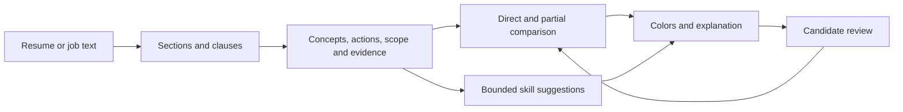

# Plan: concept-based requirements and skill discovery

**Status:** Engineering increment implemented; remaining evaluation and function expansion proposed. Recorded 2 October 2026, Europe/Amsterdam.

**Roadmap update, 4 October 2026:** [RESUME_MATCHING_REWORK](RESUME_MATCHING_REWORK.md) supersedes the remaining delivery sequence with semantic evidence comparison and backend-hosted model evaluation. Keep this document as the history of the deterministic engineering increment.

**Follow-up diagnosis, 2 October 2026:** [LLM_MATCHING.md](LLM_MATCHING.md) records reproduced section/line-boundary loss, mixed obligations, alternative-list failures and sparse comparison coverage. Its structure-first delivery sequence and optional local-model evaluation refine the next increment; the current product remains deterministic and has no LLM integration.

**Objective:** Understand more natural descriptions, expand the vocabulary, and distinguish full coverage, partial coverage, suggested unmentioned skills and missing evidence. Keep runtime analysis deterministic, explainable and private. This extends [MATCHING](MATCHING.md) and [SKILL_RELATIONS](SKILL_RELATIONS.md); [SEMANTICS](SEMANTICS.md) records the shipped engineering increment.

## 1. Findings from the current design

The existing design provides useful foundations: canonical IDs, original evidence, a directed adjacency list, bounded traversal, separate job features, transient candidate profiles and generated API contracts. Keep these.

Baseline limitations recorded before the 2 October implementation (historical findings):

- [Vocabulary](../backend/src/domain/resume/vocabulary.ts) is a flat collection of labels and aliases with regular expressions. An unfamiliar phrasing of a familiar capability can be missed.
- [Requirements](../backend/src/domain/matching/requirements.ts) infer importance from headings and cue phrases, then extract individual skill mentions. They do not represent an action, its object, the intended outcome or complex logical relationships as a structured clause.
- [Relations](../backend/src/domain/matching/skill-relations.ts) contain a source, target, weight and reason, but no relation type. A transferable capability and a possible associated tool look alike to the algorithm.
- Listed, learning and graph-derived evidence all become orange. The UI cannot distinguish partial coverage from an unmentioned skill worth asking about.
- A work-section keyword becomes supporting evidence, without retaining whether it describes using a tool, developing its internals, assisting another team or merely describing an employer's environment.
- Candidate matching requests carry IDs/statuses, not structured action or scope evidence. Adding a richer sentence parser alone will not solve matching unless these semantics survive the analysis-to-review-to-match boundary.
- Broad sentences with unresolved residual terms can force manual review even when their central capability is understood. Removing this safeguard globally would hide genuinely unrecognized requirements.

The next design should improve evidence representation first, then expand recognition. Adding many aliases or increasing all graph weights would amplify the existing ambiguity.

## 2. Color and decision contract

Use a semantic decision, then derive the color. Do not select colors from numeric score thresholds.

| Decision         | Color  | Meaning                                                                                                                 | Ranking treatment                                                         |
| ---------------- | ------ | ----------------------------------------------------------------------------------------------------------------------- | ------------------------------------------------------------------------- |
| Full coverage    | Green  | Strong explicit evidence or explicit user confirmation covers this understood requirement, including its relevant scope | Full skill credit; independent years/eligibility requirements still apply |
| Partial coverage | Yellow | Some useful evidence exists, but coverage, scope or proficiency remains incomplete                                      | Bounded partial credit; required gap remains visible                      |
| Suggested skill  | Purple | Related evidence suggests an unmentioned skill worth asking the candidate about                                         | Zero additional credit until answered; required gap remains visible       |
| No evidence      | Red    | No supporting evidence, or the candidate explicitly denies this skill                                                   | Zero credit; required gap remains visible                                 |

Green means full confidence **in this evidence match**, not independent certification of the candidate's ability. Exact spelling is neither necessary nor sufficient for green: an unambiguous supported paraphrase can be green, while a bare matching word may remain yellow.

Unknown interpretation is a separate “Needs review” flag. An unparsed clause must not become a confidently red assessment or disappear from the job's requirements. Learning can be yellow with zero credit and an explicit “Learning” label. Explicit denial is red and prevents that suggestion from appearing again for the current profile.

The existing orange presentation becomes yellow for partial evidence. Existing untyped graph edges must be reviewed before they are assigned purple/full-coverage behavior; no automatic reclassification by weight.

## 3. Expand a concept registry, rather than a keyword list

Keep stable existing IDs. Give each concept:

- Preferred name, definition, aliases, spelling/abbreviation variants and exclusions.
- Kind: language, tool, platform, technical capability, method, domain or people competency.
- Function families and context cues that distinguish technical from ordinary language.
- Parent concepts, typed relations and the scope each relation can support.
- Recognition patterns with positive and negative examples.
- Provenance, review status and policy version; external mappings are optional.

A concept may have facets such as **using a compiler**, **maintaining build tooling** and **developing compiler internals**. Do not turn “compiled a C++ application” into “developed compiler optimizations.” Store facets with evidence instead of creating an uncontrolled number of synonymous nodes.

Start with a reviewed engineering release of roughly 200–300 total concepts; this is a proposed coverage target, not a quality gate. Add a concept only when an example and a recognition test justify it.

| Engineering family          | Initial additions and distinctions                                                                                                                                                      |
| --------------------------- | --------------------------------------------------------------------------------------------------------------------------------------------------------------------------------------- |
| Compilers and build systems | LLVM, Clang, GCC, MSVC, clang-tidy, LLDB, GDB, CMake, Ninja, compiler frontends, intermediate representations, optimization passes, static analysis; tool usage versus tool development |
| Systems and performance     | Allocation, ownership, RAII, synchronization, locks/atomics, race conditions, profiling, CPU/cache behavior, latency, throughput, SIMD and benchmarking                                 |
| Distributed services        | Replication, sharding, partitioning, consensus, retries, failover, circuit breakers, idempotency, messaging, consistency and availability                                               |
| Cloud and operations        | Provider-specific services, infrastructure as code, orchestration, monitoring, tracing, SLOs, incident response and deployment strategies                                               |
| Backend and data            | API design, authentication, transactions, indexing, query optimization, caching, queues, batch/stream processing and schema design                                                      |
| Delivery and leadership     | Architecture decisions, technical direction, mentoring, direct management, cross-team delivery and stakeholder coordination, kept as separate competencies                              |

Use official technology documentation to review tool relationships. Clang supplies a C-family frontend/tooling infrastructure for LLVM; LLVM encompasses compiler/toolchain projects. This supports an ecosystem relation, not the inference that every C++ developer has used either tool. [Clang documentation](https://clang.llvm.org/), [LLVM overview](https://llvm.org/).

[ESCO downloads](https://esco.ec.europa.eu/en/use-esco/download) and the [O*NET database](https://www.onetcenter.org/database.html) are optional sources of occupational concepts, labels and technology vocabulary. Both offer downloadable data. Review a pinned subset offline, record provenance and applicable attribution/terms, and map it to our IDs. Neither source establishes that a candidate possesses a skill or supplies calibrated matching weights. Do not bulk-import their entire taxonomy or perform live taxonomy calls with resumes.

## 4. Typed relations and separate inference modes

Keep the adjacency list. A graph database is unnecessary for this bounded local policy. Add relation types with distinct permissions:

| Relation                 | Example                                           | Permitted conclusion                                                                                        |
| ------------------------ | ------------------------------------------------- | ----------------------------------------------------------------------------------------------------------- |
| Equivalent label         | “multi-threading” ↔ “multithreading”              | Same concept, with the original claim strength preserved                                                    |
| Specialization           | PostgreSQL query work → relational query work     | Broader capability only to the extent that the recorded action supports it; never the reverse automatically |
| Demonstrates capability  | Implemented automatic failover → failure recovery | A supported semantic interpretation, subject to context and extraction certainty                            |
| Transferable/related     | Redis work → distributed-systems experience       | Yellow partial evidence with a reason and capped credit                                                     |
| Possible associated tool | C++ development → Clang familiarity               | Purple question; no asserted skill and no score credit                                                      |
| Ecosystem membership     | Clang → LLVM ecosystem                            | Navigational/related evidence; membership alone does not establish LLVM development expertise               |

An edge should record type, direction, evidence predicates, supported facets, rationale and permitted use: recognition, partial scoring, suggestion or navigation. Keep numerical partial-credit weights separate from extraction certainty and suggestion priority.

Preserve two-hop bounds for partial scoring initially, strongest-path selection and cycle/duplicate protection. Alias normalization should happen before traversal. Broad capability-to-tool edges should not generate arbitrary chains of suggestions: initially allow one reviewed suggestion edge from original supported/confirmed evidence. Only suggest skills relevant to the open job; cap the initial UI at five suggestions. Negated and learning claims cannot seed suggestions. Low-value paths may appear in an explanation without generating intrusive prompts.

### C++ / Clang / LLVM example

1. Resume says “Built C++ services”; job asks for Clang. Show purple: “Your C++ work may involve Clang. Have you used it?”
2. Candidate confirms Clang usage. Record a transient, user-confirmed **tool-usage** claim. A Clang-usage requirement can become green.
3. If the job asks for Clang frontend development, the usage claim remains yellow or unresolved; ask for that specific experience rather than upgrading it automatically.
4. Candidate says they have not used Clang. Mark that skill red and suppress the repeated prompt for this profile.
5. LLVM optimization-pass development stays unproven from either general C++ experience or merely invoking Clang.

## 5. Interpret sentences as evidence-bearing clauses

Use one shared concept-recognition core for resumes and jobs, with separate context/importance policies. Keep the original text and exact character offsets at every stage.

The deterministic pipeline should:

1. Normalize whitespace, punctuation and safe variants while maintaining a mapping to original offsets. Avoid generic stemming of technology identifiers such as C++, C#, Go and R.
2. Identify headings and bounded clauses, with bullet and sentence structure retained.
3. Detect subject/actor, action, object/mechanism and outcome with reviewed phrase patterns and small grammatical slots. Normalize forms such as build/built/building explicitly.
4. Apply negation, hedging, learning, hypothetical statements and employer-versus-candidate context before asserting a skill. Negation must cover coordinated lists, not just the immediately adjacent keyword.
5. Recognize exact aliases first, then reviewed concept paraphrases; retain unresolved fragments separately.
6. Represent requirement logic explicitly: AND, OR, preferred, optional and exclusion; attach years to the intended activity instead of the whole sentence.
7. Emit evidence records containing concept, facet, interpretation kind, certainty bucket, rule ID/version and original span. Generic words such as “performance” require technical action/object context.

Initial abstract mappings should include contrasting examples:

| Sentence                                                                      | Interpretation                                                                      | Guard / contrasting case                                                   |
| ----------------------------------------------------------------------------- | ----------------------------------------------------------------------------------- | -------------------------------------------------------------------------- |
| “Keep services running when individual machines fail”                         | Availability/failure recovery, with the mechanism or guarantee still needing review | “Our platform keeps services running” is employer context                  |
| “Implemented automatic failover between replicas”                             | Specific evidence of failover/failure recovery                                      | “Observed another team implementing failover” does not establish ownership |
| “Cut p99 request time by profiling lock contention”                           | Latency optimization, profiling and synchronization evidence                        | “Improved team performance” is not systems-performance evidence            |
| “Delivered changes spanning engineering, product and operations”              | Cross-functional delivery/coordination                                              | It does not by itself establish direct people management                   |
| “Owned initiatives across teams and set technical direction”                  | Cross-functional technical leadership                                               | “Participated in meetings with several teams” supports collaboration only  |
| “No experience with AWS or Azure”                                             | Negated evidence for both providers                                                 | Do not propagate a positive cloud inference through either claim           |
| “7+ years building production systems, including 2+ years managing engineers” | Two activity-scoped thresholds                                                      | Career duration cannot substitute for management duration                  |

Abstract job requirements and abstract resume evidence need separate certainty checks. If a paraphrase is not precise enough to establish equivalence, retain yellow/review rather than silently awarding green. Surface matched clauses as well as tool keywords so the user can inspect what the rule interpreted.

This improves a curated set of English paraphrases without runtime AI. Deterministic patterns cannot understand every abstract sentence. Arbitrary semantic understanding through embeddings/LLMs is deferred; it would require a separate privacy, cost, explanation and evaluation decision. No AI dependency is introduced by this plan.

## 6. Evidence, scoring and architecture

Implement small pure domain modules, composed in order; keep filesystem/network/database access in infrastructure. Suggested modules below are proposed locations, not files that already exist:

- `domain/semantics/concepts.ts`: canonical definitions and typed, reviewed data packs.
- `domain/semantics/clauses.ts`: normalization, original-offset mapping, clause/context interpretation.
- `domain/semantics/recognize.ts`: ordered exact/phrase recognizers producing structured evidence.
- `domain/matching/skill-relations.ts`: typed partial-evidence traversal and a separate bounded suggestion policy.
- `domain/matching/score.ts`: evidence comparison by requirement and facet; no inference-specific UI colors.
- Application use cases orchestrate analysis, corrections and comparison. API serialization presents semantic decisions; frontend presentation maps them to colors.

Use composition and typed discriminated unions. Do not add an interface for every helper, a general NLP framework or a dependency-injection container. Keep graph/rule validation and data-pack compilation in developer/operator tooling. Use indexed exact/phrase lookup and candidate projection once per ranking request; avoid running sentence recognizers for every stored job on every candidate request.

Preserve a distinction between **source evidence**, **interpretation certainty**, **coverage decision**, **partial credit** and **suggestion priority**. A 70% relation weight is not 70% confidence that a candidate has the skill. Color belongs to the coverage decision, not a numerical threshold.

Extend the private reviewed-profile contract with bounded structured evidence: canonical concept/facet IDs, assertion kind, certainty, validated supporting activity references where available and user review status. Raw resume sentences/contact details must not enter matching requests or logs. Do not accept client-computed experience totals, scores or arbitrary graph edges. Recompute comparison server-side from the allowlisted claims and pinned policies; user-confirmed claims are self-reports, not verified attestations.

Equivalent clauses or multiple keywords from the same underlying activity must not inflate credit through repetition. Prefer the strongest independent support; do not sum correlated paths or automatically equate quantity of evidence with confidence. A broad requirement with unresolved facets cannot become fully met from a parent concept.

Keep existing skill/experience/function/location dimensions initially. Purple adds zero credit and no claim to the profile until answered. Yellow remains partial, and employer context cannot override its required gaps. Leadership/skill-specific years stay uncertain until reviewed intervals can support them. Candidate confirmations must invalidate review, results and pagination; the user reviews the revised profile before reranking.

Public job features may store richer clause/requirement evidence, with bounded size and offsets. Candidate evidence and confirmations remain in tab/request memory. Pin registry, clause-rule, relation and scoring versions; include every relevant version in feature/cursor invalidation. Backfill public job features with the existing race-safe workflow, never candidate profiles. Regenerate OpenAPI types after contract changes.

## 7. Incremental delivery and test gates

| Step                                                     | Deliverable                                                                                                                                                                                              | Test before progressing                                                                                                                                                |
| -------------------------------------------------------- | -------------------------------------------------------------------------------------------------------------------------------------------------------------------------------------------------------- | ---------------------------------------------------------------------------------------------------------------------------------------------------------------------- |
| 1. Establish the baseline                                | Label 150–200 synthetic clauses across compiler, systems, distributed/cloud and leadership examples, plus 20–30 profile/job pairs. Split development and held-out examples by phrasing family            | Record current misses, false positives, gap outcomes and ranking order; include negation, context, alternatives and separate tenure                                    |
| 2. Introduce decisions and colors                        | Add full/partial/suggested/no-evidence decisions; green/yellow/purple/red legend and accessible labels. Initially keep current matching behavior and do not invent purple suggestions from untyped edges | Existing scores/order remain stable; missing and uncertain interpretations remain visible; color does not depend on partial-credit thresholds                          |
| 3. Build the typed engineering registry                  | Migrate stable IDs/aliases; add compiler/toolchain concepts and review existing relation types                                                                                                           | Validate unique IDs, dangling/duplicate edges, direction, facets and rule examples; C++ cannot automatically satisfy LLVM/Clang                                        |
| 4. Add clause interpretation                             | Implement technical actions/outcomes and coordination/leadership patterns, polarity, qualifiers and requirement logic                                                                                    | Interpret each example in section 5, retain exact spans, preserve unresolved fragments, and reject contextual/negative false matches                                   |
| 5. Add purple review prompts                             | Job-specific suggestions with evidence, scoped confirmation/denial/unsure and a five-prompt cap                                                                                                          | Unanswered prompts add zero score; denial suppresses repeats; usage confirmation cannot meet tool-development requirements; edits abort stale requests                 |
| 6. Connect evidence and validate the engineering release | Carry bounded structured evidence through analysis/review/matching; derive clause highlights and requirement explanations from the same decisions                                                        | Compare held-out outcomes manually and automatically; regenerate contracts, backfill, test cursor/version invalidation, privacy, database races and mobile interaction |
| 7. Broaden by function                                   | Add reviewed data/AI, product, sales and people packs, one at a time                                                                                                                                     | Evaluate each function independently; avoid technical “performance” leakage into sales/people and generic “lead” leakage into management                               |

Suggested release targets, to be reviewed against the baseline:

- At least 95% precision for green **coverage decisions** on held-out understood requirements; precision/recall reported separately and with sample counts. This is an evaluation target, not a claimed capability.
- Improve recognition of the labeled abstract engineering clauses over baseline without increasing unsafe green decisions; aim for at least 80% recall on this bounded initial corpus.
- Zero violations in explicit invariants: contextual statements becoming mandatory, negation becoming positive, purple awarding credit, unknown tenure becoming established and correlated paths inflating credit.
- Evaluate suggestion usefulness through human labels, independently from requirement extraction and scoring. No metric may be improved by simply hiding difficult cases.
- Preserve the existing 25,000-feature bounded scan and resource limits; benchmark representative dense requirements and a 200-claim profile as well as simple fixtures. Profile once, rank by lookups, and report latency/memory rather than treating a synthetic unit test as a production load guarantee.
- Check contrast, non-color labels, keyboard-accessible explanations/actions, small-screen wrapping and original-description restoration.

Every implementation increment runs appropriate behavior tests and types, plus final root `pnpm lint`. A release runs `pnpm check` and dedicated PostgreSQL checks where projection/persistence changes occur. The plan itself requires only formatting and link/command validation.

## 8. First implementation boundary

Implementation update, 2 October 2026: [SEMANTICS.md](SEMANTICS.md) documents the shipped 215-concept registry, 16 clause rules, typed relations, green/yellow/purple/red states and scoped confirmation flow. The 176 clause contrasts and 30 profile/job pairs are development regressions, not independent held-out evaluation. Broader role packs, production load measurements and calibration remain proposed.

Start with steps 1–3: the evaluation corpus, semantic match states/colors, and a typed compiler/systems registry. This creates a testable distinction between partial evidence and skill-discovery questions before sentence inference broadens the inputs. Then deliver the first clause patterns and purple confirmation flow together, so new interpretations can be corrected and tested end to end.

The engineering milestone is complete when an abstract job sentence maps to an explained requirement, equivalent resume evidence covers it without an exact keyword, C++ produces an appropriate purple tooling question, and the answer updates the comparison without overstating proficiency or years. Other functions follow after this milestone passes its evaluation gates.

Follow-up on 2 October 2026: stages 1-3 of [LLM_MATCHING](LLM_MATCHING.md) are implemented in [STRUCTURED_MATCHING](STRUCTURED_MATCHING.md), extending the initial registry to 239 concepts and 21 rules with document structure and sentence evidence. The local-model stages remain proposed.
